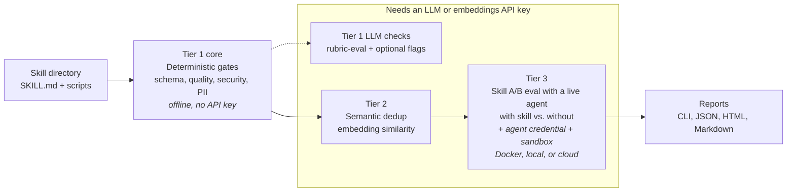

# SkillEvaluator


[](LICENSE)
[](https://www.python.org/)

SkillEvaluator is an open-source, multi-tier framework for evaluating AI
agent skills — deterministic quality gates, semantic overlap detection,
synthetic eval dataset generation, and live agent evaluation. A skill is a
folder of instructions and scripts (a `SKILL.md` plus supporting files) that
extends an AI agent — see the
[Agent Skills specification](https://agentskills.io/).
SkillEvaluator gates skills through three progressively deeper tiers, from
free offline checks to live agent A/B evaluation:

## Three-tier overview

| Tier | Purpose | Representative commands | Requires |
| --- | --- | --- | --- |
| Tier 1 | Validate schema, quality, security, secrets, PII, licenses, code integrity, Unicode safety, and scripts; optionally add LLM judging and deeper security analysis | `validate`, `quality-check`, `security-scan`, `pii-scan`, `lint-scripts`, `rubric-eval` | Deterministic checks need no API key; full scanner coverage needs the `security` extra and Gitleaks; LLM checks need a provider key |
| Tier 2 | Detect redundant content within one skill and overlapping skills across a collection or local catalog | `context-optimization-check` / `dedup-scan` (intra-skill), `similarity-check` (inter-skill) | An embeddings provider; intra-skill analysis also needs a chat LLM — local OpenAI-compatible endpoints work |
| Tier 3 | Create evaluation datasets and measure agent behavior with and without a skill | `create-eval-dataset`, `evaluate`, `compare` | Keyless templates and report inspection need no credential; LLM generation needs a provider key; live evaluation also needs the agent credential and a Docker, local OS, or cloud sandbox |

Each tier is an independent entry point — run any command directly; nothing
requires running the earlier tiers first. With no keys configured and the Tier
1 scanners installed, `validate` runs without an API credential (its dedup pass
skips gracefully); the
[credential map](docs/configuration.mdx#what-needs-credentials-and-what-runs-offline)
lists exactly what each command needs.

## Quickstart

Install every SkillEvaluator Python feature with one command. [uv](https://docs.astral.sh/uv/)
automatically provisions Python 3.13; if uv is not installed yet, follow its
[one-command installation](https://docs.astral.sh/uv/getting-started/installation/):

```bash
uv tool install --python 3.13 "skillevaluator[all] @ git+https://github.com/NVIDIA/SkillEvaluator.git"
```

This project will download and install additional third-party open source software projects. Review the license terms of these open source projects before use.

The `all` bundle includes the Tier 1 Python scanners, Tier 2, Tier 3 with
Harbor, and LLM clients. System-level tools remain explicit:
Gitleaks is required for a complete Tier 1 security result, Docker is required
for Tier 3 Docker mode, and live evaluation needs the selected agent CLI and
credentials.

Linux installs use scanner versions compatible with glibc 2.28, including
RHEL 8; see the [installation guide](docs/installation.mdx#linux-security-scanner-compatibility)
for the platform-specific dependency details.

Run the first offline check directly against your own skill — **no API key,
Docker, Gitleaks, or repository clone required**:

```bash
skillevaluator quality-check ./my-skill
```

For a complete offline Tier 1 run, install Gitleaks once, then use `validate`:

```bash
brew install gitleaks                                      # macOS
skillevaluator validate ./my-skill --no-dedup
```

On other platforms, install a binary from the official
[Gitleaks releases](https://github.com/gitleaks/gitleaks/releases).

For a smaller Tier 1-only environment, install the `security` extra instead of
`all`; see [installation options](docs/installation.mdx#choosing-extras).

If the shell can't find `skillevaluator` after installing, run
`uv tool update-shell` and open a new terminal (uv installs tools to
`~/.local/bin`, which may not be on PATH yet).

Then work through the tiers below with your own skill.



## Tier 1: Static and Security Validation

Deterministic checks run offline after their scanner binaries are installed —
this is the everyday command and a ready-made CI gate (`validate` exits
non-zero when a check fails or required scanner evidence is incomplete). Plain
`validate` also runs the Tier 2 dedup pass by default, skipping it
gracefully when no key is configured:

```bash
skillevaluator validate ./my-skill --no-dedup   # all offline checks
skillevaluator security-scan ./my-skill         # one category at a time
skillevaluator rubric-eval ./my-skill           # LLM-as-judge scoring — the one Tier 1 command that needs a provider key
```

| Check | What it covers |
| --- | --- |
| `schema` | Frontmatter, folder structure, naming, and content policy |
| `security` | SkillSpector scanning for prompt injection, data exfiltration, and related risks |
| `pii` | Credentials, tokens, personal data, and other sensitive information |
| `license` | Frontmatter, license-file, and SPDX compliance |
| `code-integrity` | Bandit, Semgrep with packaged policy, Gitleaks, links, dependency declarations, and static test discovery |
| `unicode` | Invisible Unicode, bidirectional overrides, and ASCII smuggling |
| `quality` | Deterministic quality scoring with a 0–100 score and A–F grade |
| `lint` | Advisory script structure, nesting, constants, shebang, and input-validation checks |
| `version` | Default optional-version and monotonic SemVer validation |
| `dependency` | Optional dependency vulnerability audit |

`rubric-eval` adds an LLM-as-judge review across nine instruction-quality
criteria. The optional `--llm` and `--llm-verify` flags deepen security
analysis and can suppress false positives.

Check selection (`--checks`), report formats (`-r cli,json,html,markdown`), the
automatically generated `BENCHMARK.md`, skill discovery, the optional
`--llm`/`--llm-verify` deepening, and a CI recipe:
[Tier 1 guide](docs/tier1-validation.mdx).

## Configure a provider (for the LLM-backed parts)

LLM-backed features use the configured chat provider. Tier 2 also needs an
embeddings provider: it can use the same service when embeddings are available,
or a separately configured local or hosted endpoint. A free
[NVIDIA API Catalog](https://build.nvidia.com/) key covers both LLM judging and
Tier 2 embeddings with one variable:

```bash
export SKILL_EVAL_LLM_PROVIDER=nv_build
export NVIDIA_API_KEY='nvapi-...'
skillevaluator models
```

`skillevaluator models` shows a filtered, bounded view of model candidates
visible to the selected provider key; add `--json` for machine-readable
output. Catalog visibility is not proof that an agent harness can execute the
model. Use `doctor` and a live Tier 3 evaluation for runtime and end-to-end
verification.

OpenAI, Anthropic, Bedrock, any OpenAI-compatible endpoint, and fully local
servers work too: [configuration guide](docs/configuration.mdx).

The external publication profile is the default. `--external` is shorthand
for `--profile external`, and `--policy` can overlay a custom policy file.

## Tier 2: Semantic Deduplication

With a provider configured, find duplicated guidance inside one skill or
compare skills with embeddings. `dedup-scan` is an alias for the canonical
intra-skill command:

```bash
# Intra-skill: cluster overlapping sections, then analyze them with a chat LLM
skillevaluator context-optimization-check ./my-skill
skillevaluator dedup-scan ./my-skill  # alias

# Inter-skill: compare every skill in a local collection (embeddings only)
skillevaluator similarity-check ./skills

# Or save that collection as a local catalog and query one candidate against it
skillevaluator similarity-check ./skills --save-catalog ./skill-catalog.json
skillevaluator similarity-check ./candidate-skill --catalog ./skill-catalog.json
```

Similarity findings use four classifications: `EXACT_DUPLICATE` (at least
0.95), `HIGH_SIMILARITY` (at least 0.90), `SIMILAR` (at least 0.75), and
`LOOSELY_RELATED` (at least 0.50).

The catalog is a versioned JSON file containing embeddings and skill metadata,
not credentials. It stays local unless you choose to share it; no external
vector database or catalog service is involved. Thresholds, reports, catalog
validation, and exactly where the chat LLM comes in:
[Tier 2 guide](docs/tier2-deduplication.mdx).

## Tier 3: Live Agent Evaluation

Tier 3 evaluates your skill by running a real agent (`opencode`, `codex`, or
`claude-code`) against generated tasks, with and without the skill, inside
[Harbor](https://github.com/harbor-framework/harbor) sandboxes. Most runs use
**Docker** (the default) or **experimental local mode** (`--env-mode local`:
Linux bubblewrap, no Docker; macOS Seatbelt is semi-trusted and blocks common
detached shell patterns but has no PID namespace). Local mode is intended for
trusted skills and workspaces; Docker provides stronger isolation for
untrusted code. Native Windows local mode is unsupported, including
trusted/unsandboxed overrides; use WSL2 for the Linux local path or Docker
instead. Set `SKILLEVALUATOR_LOCAL_STRICT_READS=1` for deny-all reads with only
selected runtime/system exceptions. On Linux/macOS, unsandboxed local execution
requires explicitly opting into trusted mode. Cloud backends are available
through the same `--env-mode` flag.

`claude` is accepted as a convenience alias in agent lists, model overrides,
and `evals/config.yml`. Skill Evaluator canonicalizes it to `claude-code`, so
result keys, paths, progress, and reports always use `claude-code`.

Standard grading reports lead with five human-readable dimensions. Skill Lift
is the measured difference between the with-skill and without-skill runs, while
pass@k shows multi-attempt reliability separately from the dimension scores.
In `custom_only` mode, the user-owned grader defines the score instead.

| Dimension | Question |
| --- | --- |
| **Security** | Is it safe to use? |
| **Correctness** | Does it do what it is supposed to? |
| **Discoverability** | Is it loaded when it should be? |
| **Effectiveness** | Is it better with the skill than without? |
| **Efficiency** | Does it use tools and tokens efficiently? |

Live evaluation normally has **two credential roles**: the evaluator provider
generates tasks and performs standard grading, while the selected agent uses
its native provider credential. NVIDIA Build is an explicit Docker and local
exception: one `NVIDIA_API_KEY` powers direct OpenCode and SkillEvaluator's
compatibility bridges for Codex and experimental Claude Code. Operator
credentials come only from the host environment; a checked-out skill cannot
replace, alias, or reroute them through `evals/config.yml`.

This external-user path needs only a Build key from
[build.nvidia.com](https://build.nvidia.com/):

```bash
# 1. Readiness check first — seconds, and it names any missing key or sandbox
skillevaluator doctor --agents opencode --env-mode docker --verify-models

# 2. Generate eval tasks (writes evals/evals.json; --no-llm for a keyless template)
skillevaluator create-eval-dataset ./my-skill --full
skillevaluator create-eval-dataset ./my-skill --full --refine

# Or replace steps 2 and 3 with one non-destructive autopilot command
skillevaluator tier3 evaluate ./my-skill --autopilot --agents opencode --env-mode docker

# 3. Run the with-skill vs. without-skill evaluation
skillevaluator tier3 evaluate ./my-skill --agents opencode --env-mode docker

# 4. Read the results
skillevaluator view ./my-skill      # HTML report
skillevaluator compare ./my-skill   # side-by-side comparison
```

For Docker or local NVIDIA Build runs, change `--agents opencode` to
`--agents codex` or `--agents claude-code`; no second provider key is needed.
Direct OpenCode defaults to `nvidia/nemotron-3-nano-30b-a3b` (rendered as
`nvidia/nvidia/nemotron-3-nano-30b-a3b`). Bridged Codex and experimental Claude
Code default to `nvidia/nemotron-3-super-120b-a12b`, the verified model for
their larger tool surfaces. Choose a different model explicitly when comparison
requirements justify it:

```bash
# Nemotron Super: explicit higher-quality override for each harness.
skillevaluator evaluate ./my-skill --agents opencode --env-mode docker \
  --agent-model opencode=nvidia/nvidia/nemotron-3-super-120b-a12b
skillevaluator evaluate ./my-skill --agents codex --env-mode docker \
  --agent-model codex=nvidia/nemotron-3-super-120b-a12b
skillevaluator evaluate ./my-skill --agents claude-code --env-mode docker \
  --agent-model claude-code=nvidia/nemotron-3-super-120b-a12b

# Llama remains an explicit direct-OpenCode alternative.
skillevaluator evaluate ./my-skill --agents opencode --env-mode docker \
  --agent-model opencode=nvidia/meta/llama-3.1-8b-instruct
```

SkillEvaluator never changes explicit model overrides silently. The bridges are
available in Docker and local modes. Harbor cloud modes still require an
independent OpenAI Responses credential for Codex or a native Anthropic
credential for Claude Code. Do not put agent credentials in skill-owned
`harbor.runtime_env`.

Results are written under `evals/results` by default. Use `--results-dir` or
`SKILLEVALUATOR_RESULTS_DIR` to place them elsewhere. The `--refine` option
uses existing or collected agent trajectories to improve generated cases.
Raw Harbor job and staged-task directories are temporary and deleted by
default. Add `--harbor-keep-jobs` to retain them; the final **Artifacts** panel
then prints the canonical `skillevaluator tier3 harbor-view <JOBS_DIR>` command.

Custom graders, Harbor-format tasks, and agent credential setup:
[Tier 3 guide](docs/tier3-live-evaluation.mdx).

## Expert tier aliases

Tier-prefixed commands call the same implementations as the primary commands:

```bash
skillevaluator tier1 validate ./my-skill --no-dedup
skillevaluator tier2 similarity-check ./skills
skillevaluator tier3 evaluate ./my-skill --agents opencode --env-mode docker
```

## Installation options

The quickstart one-liner installs everything. For per-tier extras, plain pip,
or Docker, see [installation](docs/installation.mdx). Contributors work from a
source checkout:

```bash
git clone https://github.com/NVIDIA/SkillEvaluator.git
cd SkillEvaluator
uv sync --python 3.13 --all-extras
```

## Documentation

- [Installation](docs/installation.mdx) — extras, pip, Docker, requirements
- [Tier 1 guide](docs/tier1-validation.mdx) — checks, flags, reports, CI recipe
- [Tier 2 guide](docs/tier2-deduplication.mdx) — dedup commands and thresholds
- [Tier 3 guide](docs/tier3-live-evaluation.mdx) — skill evaluation with live agents, in depth
- [Configuration](docs/configuration.mdx) — credential map, providers, and embeddings
- [Developer guide](docs/developer-guide.mdx) — contributor setup
- Related: [SkillSpector](https://github.com/NVIDIA/SkillSpector) (skill
  security scanner used by the `security` extra),
  [Agent Skills specification](https://agentskills.io/),
  [Harbor](https://github.com/harbor-framework/harbor)

## Contributing

Contributions are welcome — read [CONTRIBUTING.md](CONTRIBUTING.md), include
tests for behavior changes, and run the checks before opening a PR:

```bash
make lint && make test && make build
```

Project governance is described in [GOVERNANCE.md](GOVERNANCE.md).
Participation is governed by the [Code of Conduct](CODE_OF_CONDUCT.md).

## Support

Support level: **Experimental**. SkillEvaluator is community-supported on a
best-effort basis with no SLA or NVIDIA enterprise support entitlement. Report
reproducible bugs and feature requests through
[GitHub Issues](https://github.com/NVIDIA/SkillEvaluator/issues); see
[SUPPORT.md](SUPPORT.md) for details.

## Security

Report suspected vulnerabilities using the private process in
[SECURITY.md](SECURITY.md). Do not disclose security issues in a public GitHub
issue.

## Releases

Release changes are recorded in [CHANGELOG.md](CHANGELOG.md) and
[GitHub Releases](https://github.com/NVIDIA/SkillEvaluator/releases).

## License

Apache License 2.0 — see [LICENSE](LICENSE), [NOTICE](NOTICE), and
[THIRD_PARTY_NOTICES.md](THIRD_PARTY_NOTICES.md).

Copyright (c) 2026 NVIDIA CORPORATION & AFFILIATES. All rights reserved.
