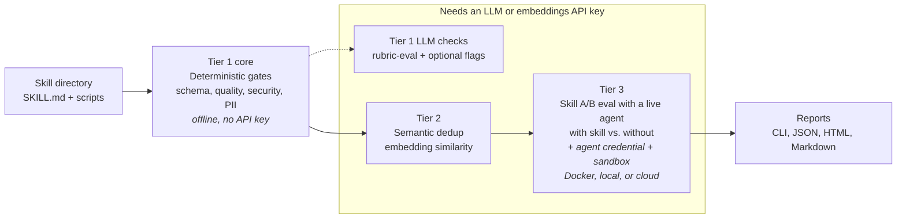

# SkillEvaluator


[](LICENSE)
[](https://www.python.org/)

SkillEvaluator is an open-source, multi-tier framework for evaluating AI
agent skills — deterministic quality gates, semantic overlap detection,
synthetic eval dataset generation, and live agent evaluation. A skill is a
folder of instructions and scripts (a `SKILL.md` plus supporting files) that
extends an AI agent — see the
[Agent Skills specification](https://agentskills.io/).
SkillEvaluator gates skills through three progressively deeper tiers, from
free offline checks to live agent A/B evaluation:

| Tier | Purpose | Representative commands | Requires |
| --- | --- | --- | --- |
| Tier 1 · deterministic core | Validate schema, quality, security, secrets, PII, licenses, code integrity, Unicode safety, and scripts | `validate`, `quality-check`, `security-scan`, `pii-scan`, `lint-scripts` | No API key; full scanner coverage needs the `security` extra and the external Gitleaks binary |
| Tier 1 · LLM checks | Judge instruction quality with an LLM; optionally deepen security analysis and suppress false positives | `rubric-eval` (LLM required), optional `--llm` / `--llm-verify` flags on the scans above | An LLM provider key |
| Tier 2 | Detect redundant content within one skill and overlapping skills across a collection or local catalog | `context-optimization-check` / `dedup-scan` (intra-skill), `similarity-check` (inter-skill) | An embeddings provider; intra-skill analysis also needs a chat LLM — local OpenAI-compatible endpoints work |
| Tier 3 | Create evaluation datasets and measure agent behavior with and without a skill | `create-eval-dataset`, `evaluate`, `compare` | Keyless templates and report inspection need no credential; LLM generation needs a provider key; live evaluation also needs the agent credential and a Docker, local OS, or cloud sandbox |

Each tier is an independent entry point — run any command directly; nothing
requires running the earlier tiers first. With no keys configured and the Tier
1 scanners installed, `validate` runs without an API credential (its dedup pass
skips gracefully); the
[credential map](docs/CONFIGURATION.md#what-needs-credentials-and-what-runs-offline)
lists exactly what each command needs.

## Quickstart

Install every SkillEvaluator Python feature with one command. [uv](https://docs.astral.sh/uv/)
automatically provisions Python 3.13; if uv is not installed yet, follow its
[one-command installation](https://docs.astral.sh/uv/getting-started/installation/):

```bash
uv tool install --python 3.13 "skillevaluator[all] @ git+https://github.com/NVIDIA/SkillEvaluator.git"
```

The `all` bundle includes the Tier 1 Python scanners, Tier 2, Tier 3 with
Harbor, LLM clients, and telemetry. System-level tools remain explicit:
Gitleaks is required for a complete Tier 1 security result, Docker is required
for Tier 3 Docker mode, and live evaluation needs the selected agent CLI and
credentials.

Run the first offline check directly against your own skill — **no API key,
Docker, Gitleaks, or repository clone required**:

```bash
skillevaluator quality-check ./my-skill
```

For a complete offline Tier 1 run, install Gitleaks once, then use `validate`:

```bash
brew install gitleaks                                      # macOS
# go install github.com/gitleaks/gitleaks/v8@latest       # Linux/other with Go
skillevaluator validate ./my-skill --no-dedup
```

For a smaller Tier 1-only environment, install the `security` extra instead of
`all`; see [installation options](docs/INSTALLATION.md#choosing-extras).

If the shell can't find `skillevaluator` after installing, run
`uv tool update-shell` and open a new terminal (uv installs tools to
`~/.local/bin`, which may not be on PATH yet).

Then work through the tiers below with your own skill.



## Tier 1: Static and security validation

Deterministic checks run offline after their scanner binaries are installed —
this is the everyday command and a ready-made CI gate (`validate` exits
non-zero when a check fails or required scanner evidence is incomplete). Plain
`validate` also runs the Tier 2 dedup pass by default, skipping it
gracefully when no key is configured:

```bash
skillevaluator validate ./my-skill --no-dedup   # all offline checks
skillevaluator security-scan ./my-skill         # one category at a time
skillevaluator rubric-eval ./my-skill           # LLM-as-judge scoring — the one Tier 1 command that needs a provider key
```

Check selection (`--checks`), report formats (`-r cli,json,html,markdown`), the
automatically generated `BENCHMARK.md`,
content types, the optional `--llm`/`--llm-verify` deepening, and a CI recipe:
[Tier 1 guide](docs/TIER1_VALIDATION.md).

## Configure a provider (for the LLM-backed parts)

Everything beyond the deterministic core shares one configured provider —
its credential is the "LLM provider key" in the table above. Quickest is a
free [NVIDIA API Catalog](https://build.nvidia.com/) key; it covers LLM
judging and Tier 2 embeddings with one variable:

```bash
export SKILL_EVAL_LLM_PROVIDER=nv_build
export NVIDIA_API_KEY='nvapi-...'
```

OpenAI, Anthropic, Bedrock, any OpenAI-compatible endpoint, and fully local
servers work too: [configuration guide](docs/CONFIGURATION.md).

## Tier 2: Semantic deduplication

With a provider configured, find duplicated guidance inside one skill or
compare skills with embeddings. `dedup-scan` is an alias for the canonical
intra-skill command:

```bash
# Intra-skill: cluster overlapping sections, then analyze them with a chat LLM
skillevaluator context-optimization-check ./my-skill
skillevaluator dedup-scan ./my-skill  # alias

# Inter-skill: compare every skill in a local collection (embeddings only)
skillevaluator similarity-check ./skills

# Or save that collection as a local catalog and query one candidate against it
skillevaluator similarity-check ./skills --save-catalog ./skill-catalog.json
skillevaluator similarity-check ./candidate-skill --catalog ./skill-catalog.json
```

The catalog is a versioned JSON file containing embeddings and skill metadata,
not credentials. It stays local unless you choose to share it; no Milvus,
vector database, or catalog service is involved. Thresholds, reports, catalog
validation, and exactly where the chat LLM comes in:
[Tier 2 guide](docs/TIER2_DEDUPLICATION.md).

## Tier 3: Skill evaluation with live agents

Tier 3 evaluates your skill by running a real agent (`codex`, and other
supported CLIs) against generated tasks, with and without the skill, inside
[Harbor](https://github.com/harbor-framework/harbor) sandboxes. Most runs use
**Docker** (the default) or **local mode** (`--env-mode local`: Linux
bubblewrap, no Docker; macOS Seatbelt is semi-trusted and blocks common
detached shell patterns but has no PID namespace; use Docker for untrusted
code). Set
`SKILLEVALUATOR_LOCAL_STRICT_READS=1` for deny-all reads with only selected
runtime/system exceptions. Unsandboxed local execution requires explicitly
opting into trusted mode. Cloud backends are available through the same
`--env-mode` flag.

**Two credentials are needed before a live run:** the evaluator provider key
from the section above (generates tasks and judges results), and the selected
agent's own native key — for example `codex` needs an OpenAI Responses key plus
`OPENAI_BASE_URL`, while `claude-code` needs an Anthropic key. NVIDIA Build's
key is not interchangeable with either agent credential.

```bash
# 1. Readiness check first — seconds, and it names any missing key or sandbox
skillevaluator doctor --agents codex --env-mode docker

# 2. Generate eval tasks (writes evals/evals.json; --no-llm for a keyless template)
skillevaluator create-eval-dataset ./my-skill --full

# 3. Run the with-skill vs. without-skill evaluation
skillevaluator evaluate ./my-skill --agents codex --env-mode docker

# 4. Read the results
skillevaluator view ./my-skill      # HTML report
skillevaluator compare ./my-skill   # side-by-side comparison
```

Custom graders, Harbor-format tasks, and agent credential setup:
[Tier 3 guide](docs/TIER3_LIVE_EVALUATION.md).

## Installation options

The quickstart one-liner installs everything. For per-tier extras, plain pip,
or Docker, see [installation](docs/INSTALLATION.md). Contributors work from a
source checkout:

```bash
git clone https://github.com/NVIDIA/SkillEvaluator.git
cd SkillEvaluator
uv sync --python 3.13 --all-extras
```

## Documentation

- [Installation](docs/INSTALLATION.md) — extras, pip, Docker, requirements
- [Tier 1 guide](docs/TIER1_VALIDATION.md) — checks, flags, reports, CI recipe
- [Tier 2 guide](docs/TIER2_DEDUPLICATION.md) — dedup commands and thresholds
- [Tier 3 guide](docs/TIER3_LIVE_EVALUATION.md) — skill evaluation with live agents, in depth
- [Configuration](docs/CONFIGURATION.md) — credential map, providers, embeddings, telemetry
- [Developer guide](docs/DEVELOPER_GUIDE.md) — contributor setup
- Related: [SkillSpector](https://github.com/NVIDIA/SkillSpector) (skill
  security scanner used by the `security` extra),
  [Agent Skills specification](https://agentskills.io/),
  [Harbor](https://github.com/harbor-framework/harbor)

## Contributing

Contributions are welcome — read [CONTRIBUTING.md](CONTRIBUTING.md), include
tests for behavior changes, and run the checks before opening a PR:

```bash
make lint && make test && make build
```

Project governance is described in [GOVERNANCE.md](GOVERNANCE.md).
Participation is governed by the [Code of Conduct](CODE_OF_CONDUCT.md).

## Support

Support level: **Experimental**. SkillEvaluator is community-supported on a
best-effort basis with no SLA or NVIDIA enterprise support entitlement. Report
reproducible bugs and feature requests through
[GitHub Issues](https://github.com/NVIDIA/SkillEvaluator/issues); see
[SUPPORT.md](SUPPORT.md) for details.

## Security

Report suspected vulnerabilities using the private process in
[SECURITY.md](SECURITY.md). Do not disclose security issues in a public GitHub
issue.

## Releases

Release changes are recorded in [CHANGELOG.md](CHANGELOG.md) and
[GitHub Releases](https://github.com/NVIDIA/SkillEvaluator/releases).

## License

Apache License 2.0 — see [LICENSE](LICENSE), [NOTICE](NOTICE), and
[THIRD_PARTY_NOTICES.md](THIRD_PARTY_NOTICES.md).

Copyright (c) 2026 NVIDIA CORPORATION & AFFILIATES. All rights reserved.
