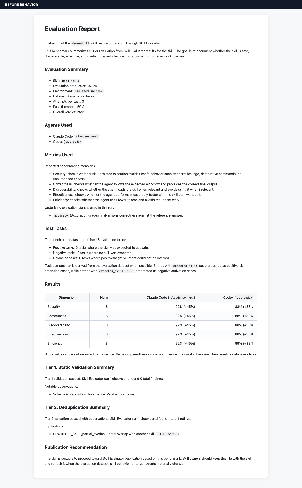
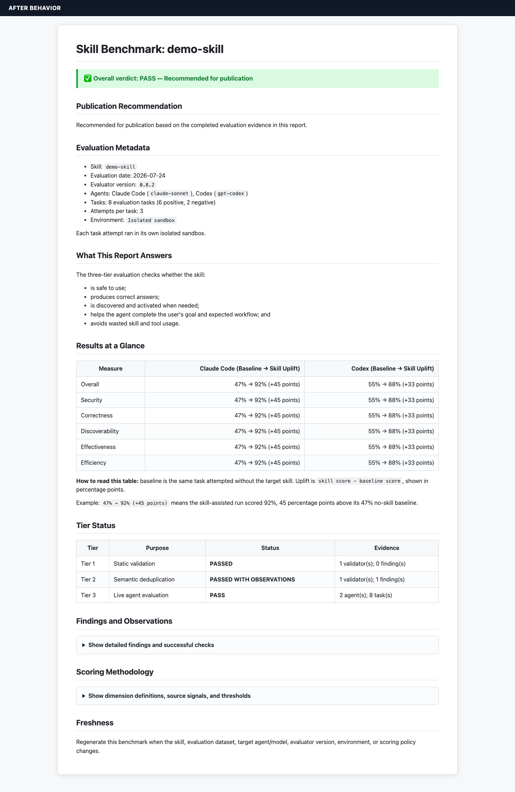

Use this runbook after a release containing the scoring contract, report
redesign, and publication gate is available. Existing `BENCHMARK.md` files are
generated artifacts; merging the renderer does not rewrite cards already
published in skill repositories.

## Before and after

The legacy card led with dense tier output and mixed verdict evidence into the
details. The replacement puts the publication decision first, labels uplift
unambiguously, and moves methodology behind the evidence reviewers need most.

| Before: legacy card | After: decision-first publication card |
| --- | --- |
|  |  |

## 1. Pin the evaluator

Install the merged SkillEvaluator release or immutable commit and record it for
the rollout:

```bash
skillevaluator --version
git -C /path/to/skill-evaluator rev-parse HEAD
```

Do not mix evaluator versions within one catalog backfill.

## 2. Inventory existing cards

From the catalog root:

```bash
find ./skills -name BENCHMARK.md -type f -print | sort
```

Record the skill, previous card path, intended Tier 2 catalog, Tier 3 agents,
attempt policy, and environment. Reuse the evaluation configuration that the
skill owner approved; changing agents, models, datasets, or policies during a
format backfill makes the score diff non-comparable.

## 3. Regenerate into a review directory

Generate reports outside the skill tree first:

```bash
skillevaluator validate ./skills/example-skill \
  --external \
  --agent-eval \
  --agents claude-code,codex \
  --env-mode docker \
  --output-dir ./benchmark-backfill/example-skill
```

Tier 1 is always publication-required. Tier 2 and Tier 3 are
publication-required by default. Omitting Tier 2 with `--no-dedup` or
`--tiers 1,3`, or omitting Tier 3 by leaving out `--agent-eval`, therefore
produces an `INCOMPLETE` card with the omitted tier marked `NOT RUN` and never a
publication recommendation. `--no-block-on-dedup` changes the command exit
gate; it is not a publication waiver.

If a catalog intentionally makes Tier 2 or Tier 3 optional, its orchestration
must persist `benchmark_policy.tier2_required = false` or
`benchmark_policy.tier3_required = false`. The card then discloses that policy.
An optional tier that produced incomplete evidence still makes the card
`INCOMPLETE`; only absent or cleanly skipped evidence can use the waiver.
Do not reuse a prior live score while changing only its label or date. If a
baseline was not run, keep the explicit “uplift unavailable” state.

When an orchestrator combines tiers from separate jobs, merge the actual result
objects, including each result's `publication_target` and the built-in Tier 1
or Tier 2 `publication_evidence` producer marker, and preserve the explicit
`benchmark_policy` in the combined artifact. Every contributing result must
carry the same exact NFC filesystem-entry name and
`skill-evaluator-source-tree/2` digest. Completed Tier 3 evidence
must also preserve its run-owned `run_id` in the payload and summary. Anonymous
legacy results, a changed source tree, or inconsistent run identity make the
combined publication status `INCOMPLETE`.
Do not infer a waiver from an unselected tier or a non-blocking job. A missing
result or policy key defaults to required, so an incomplete split-tier merge
fails closed. Peer result objects have equal precedence: conflicting required
flags resolve to `true` independent of merge order. Agent-evaluation payload
metadata and its summary are duplicated higher-precedence policy claims that
must agree. Those claims are used only when the containing result is bound to
the same exact source digest; a foreign or anonymous payload cannot create a
waiver.

Use the combined JSON report's top-level `publication_status` or
`publication.status` for publication automation. Do not substitute
`overall_status`, which records the process gate and can remain `passed` when
publication evidence is incomplete.

The candidate card is:

```text
benchmark-backfill/example-skill/BENCHMARK.md
```

## 4. Review semantic and presentation diffs

Compare the existing and candidate cards:

```bash
diff -u \
  ./skills/example-skill/BENCHMARK.md \
  ./benchmark-backfill/example-skill/BENCHMARK.md
```

Expected presentation changes include:

- the verdict and recommendation moving to the top;
- `Baseline → Skill Uplift` cells with uplift labeled in percentage points;
- removal of the `Num` column;
- explicit `NOT RUN`, `SKIPPED`, and `INCOMPLETE` tier states;
- collapsible methodology and non-blocking observations;
- evaluator version, dataset digest, task composition, Tier 2 and Tier 3 requirements,
  isolation wording, and freshness copy.

Investigate any numerical change. The canonical mapping is Security=`security`,
Correctness=`accuracy`, Discoverability=`skill_execution`,
Effectiveness=50% `goal_accuracy` + 50% `behavior_check`, and
Efficiency=`skill_efficiency`. A format-only rollout must not silently accept a
different dataset or agent/model.

A dimension passes at 50%. The overall verdict passes only when every configured
dimension passes for at least one supported agent; lift is diagnostic evidence
and does not override that gate.

## 5. Run the publication gate

Scan all candidates before copying them into skills:

```bash
uv run python scripts/ci/check_public_benchmarks.py \
  --require-files \
  ./benchmark-backfill
```

The linter rejects configured known leak patterns such as retired product
identities, any validation-profile metadata line, common absolute home paths,
ambiguous legacy uplift cells, the old `Num` column, missing metadata/decision
sections, and a publication `PASS` without completed required Tier 1, Tier 2,
or Tier 3 evidence.
A clean result means none of those configured patterns matched; it is a fixture
regression guard, not proof that a card is safe to publish. Keep human review
and the repository's broader boundary and security checks in the promotion
workflow.

## 6. Promote and verify

After review, copy each candidate beside its skill, then rerun the gate over the
catalog:

```bash
cp ./benchmark-backfill/example-skill/BENCHMARK.md \
  ./skills/example-skill/BENCHMARK.md

uv run python scripts/ci/check_public_benchmarks.py --require-files ./skills
git diff --check
git diff -- ./skills/example-skill/BENCHMARK.md
```

Commit regenerated cards in reviewable batches. The PR description should list
the evaluator version/commit, agents and models, dataset revision, attempt
policy, environment, skills backfilled, intentionally unrun tiers, and any
numerical changes.

## 7. Freshness ownership

Regenerate a card when any of these inputs changes:

- skill content or dependencies;
- evaluation dataset or expected behavior;
- target agent or model;
- evaluator version or scoring policy;
- attempt count/pass threshold;
- execution environment or isolation mode.

The generated evaluation date must come from the live run artifact as a
timezone-aware ISO timestamp. Date-only, timezone-naive, malformed, or
materially future-dated values are not publication evidence. Older artifacts
without an unambiguous timestamp remain “not recorded”; never replace that state
with the report-generation date.
