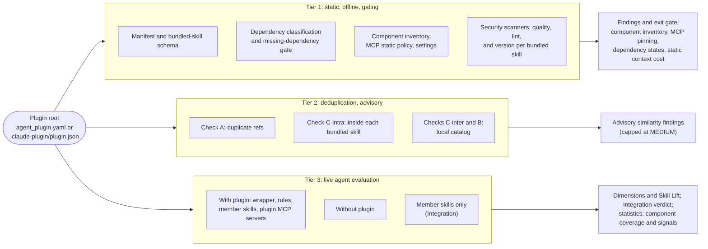

An agent plugin bundles several components: skills, rules, MCP servers, and
often hooks, subagents, commands, and settings. SkillEvaluator evaluates a
plugin with the same three tiers it uses for a single skill, and records
exactly which components each tier could check. This page is the reference
for plugin evaluation. The tier guides ([Tier 1](tier1-validation.mdx),
[Tier 2](tier2-deduplication.mdx), [Tier 3](tier3-live-evaluation.mdx)) cover
the behavior that plugins share with skills.

## Overview

Each tier answers a different question about the plugin:

- **Tier 1: static validation.** Is the plugin well-formed and safe to load?
  It checks the manifest, declared dependencies, every component path, every
  MCP server declaration, shipped settings, and the bundled skills. It runs
  offline and gates the exit code.
- **Tier 2: deduplication.** Does the plugin repeat itself or duplicate what
  already exists? It checks duplicate references, redundant guidance inside
  each bundled skill, and overlap with a local catalog of skills and plugins.
  Tier 2 is advisory for plugins.
- **Tier 3: live evaluation.** Does the coordinated plugin help a real agent?
  It runs the plugin against a no-plugin baseline and, optionally, against its
  member skills staged individually (the Integration comparison). Tier 3 is
  advisory unless you make it blocking.



| Tier | Plugin entry point | Gates `validate` | Produces |
| --- | --- | --- | --- |
| 1 | `validate PLUGIN --tiers 1` | Yes; CRITICAL and HIGH findings fail | Findings; component inventory; MCP server and pinning summary; dependency states; static context-cost estimate |
| 2 | `validate PLUGIN --tiers 1,2` or `tier2 PLUGIN --catalog FILE` | No; findings are capped at MEDIUM | Duplicate-reference, context, and catalog similarity findings |
| 3 | `tier3 evaluate-plugin PLUGIN` or `validate PLUGIN --tier3` | In `validate`, only with `--block-on-agent-eval` | Dimension scores, Skill Lift, Integration verdict, report-only statistics, component coverage, per-trial component signals |

`validate PLUGIN` runs Tiers 1 and 2 by default. Plugin Tier 3 runs only when
you request it with `--tier3` (or use `tier3 evaluate-plugin`). The direct
`tier1 PATH` and `tier3 PATH` workflows take a skill directory, not a plugin.
Use `validate PLUGIN --tiers 1` and `tier3 evaluate-plugin PLUGIN` instead.

## The key principle: staged is not loaded is not verified

A plugin evaluation can make three different claims about a component, and
they are not interchangeable:

| Claim | Meaning | Where the report records it |
| --- | --- | --- |
| **Files staged** | The component's files were copied into the with-plugin arm | Tier 3 `component_coverage`, state `staged` |
| **Component loaded** | The agent actually activated it during a trial: a `Skill` call, a read of the member's `SKILL.md`, or an MCP, subagent, or command call | Per-trial `plugin_signals.activations` and `activation_coverage.exercised` |
| **Behavior verified** | A grader scored an outcome that depends on it | Dimension scores and Skill Lift; the advisory signal graders (tool selection, arguments, order, handoffs, conflict probes) |

Staging a component proves only that it was available. A staged member skill
that no trial activates appears as `unverified` in `activation_coverage`. A
component whose every activation failed is `unavailable`. An inventoried hook
or subagent that Tier 3 cannot stage is `unsupported` in `component_coverage`,
and its count is part of `not_evaluated`.

Reports make the gaps explicit instead of letting them read as a pass:

- **Tier 1** inventories every component with a `support` level of
  `evaluated`, `static_only`, or `unsupported`, and lists the component types it
  cannot evaluate in `unsupported_types_present`.
- **Tier 3** records a coverage state and a reason for every component. When a
  declared skill, rule, or MCP server that the plugin needs could not be
  evaluated, the run is **INCOMPLETE**, never a full pass. See
  [What makes a plugin run INCOMPLETE](#what-makes-a-plugin-run-incomplete).
- **Integration** is reported as **INCONCLUSIVE**, with a reason, whenever the
  member-skills comparison was requested but not measured, was incomplete,
  paired too few cases, or could not rule out zero.
- **Context cost** comes in two forms: a static character-based estimate from
  Tier 1, and a measured first-turn prompt-token delta from Tier 3. Each
  carries a `method` field (`static_estimate` or
  `paired_first_turn_prompt_tokens`), so the two are never confused.

## Supported manifests and plugin layout

### Manifest detection

A plugin root is a directory that contains one of these manifests. When more
than one exists, the first one in this order wins:

1. `agent_plugin.yaml`
2. `agent_plugin.yml`
3. `.claude-plugin/plugin.json`

You can pass the plugin root or the manifest file itself. Auto-detection
recognizes plugins; add `--type plugin` to be explicit. Every manifest variant
must be one regular, single-link file inside the plugin root. A linked,
hard-linked, or special manifest fails as `manifest_outside_root` or
`unsafe_plugin_filesystem` even when another variant would otherwise win.

### Bundle-reference manifest: `agent_plugin.yaml`

A bundle-reference plugin references skills and rules that live elsewhere in
the same repository, and names MCP servers by provider:

```yaml title="agent_plugin.yaml"
name: release-helper
description: Triage tickets and draft release notes.
version: "1.0.0"
author:
  email: maintainer@example.com
skills:
  refs:
    - github::example-org/agent-catalog::skills::ticket-triage
    - source: github
      repo: example-org/agent-catalog
      path: skills/release-notes
rules:
  refs:
    - github::example-org/agent-catalog::rules::release-style.mdc
mcp:
  - name: tracker
    provider: example-provider
```

The manifest is validated in full against the bundle-reference schema:

| Field | Rule |
| --- | --- |
| `name` | Required, non-empty |
| `author.email` | Required and must contain `@`; extra `author` fields are allowed |
| `description`, `version`, `team`, `domain`, `tags`, `metadata` | Optional; a numeric `version` is read as a string |
| `skills.refs`, `rules.refs` | A list of refs; see [Reference sources](#reference-sources). `include` and `exclude` are accepted only as empty lists |
| `mcp` | A list of `name` plus `provider` objects. Names start with a letter or digit and use only letters, digits, `.`, `_`, and `-`. Each `(name, provider)` pair must be unique |
| Dependencies | At least one of `skills.refs`, `rules.refs`, or `mcp` must be non-empty |

Unknown top-level fields are rejected, and each schema error is reported as a
HIGH `schema:<field>:<error>` finding.

### Contained manifest: `.claude-plugin/plugin.json`

A contained plugin ships its components inside the plugin root, in the Claude
Code plugin layout:

```json title=".claude-plugin/plugin.json"
{
  "name": "release-helper",
  "description": "Triage tickets and draft release notes.",
  "mcpServers": [
    "./config/mcp.json",
    { "docs": { "url": "https://docs.example.com/mcp", "type": "http" } }
  ]
}
```

SkillEvaluator validates `plugin.json` shallowly: it must be a non-empty JSON
object with a non-empty `name` of at most 64 characters. The full Claude Code
plugin schema is not validated. The component fields (`skills`, `commands`,
`agents`, `hooks`, `mcpServers`, `lspServers`, `outputStyles`,
`experimental.monitors`, and `settings`) are read for the
[component inventory](#component-inventory). Declared paths must stay inside
the plugin root: an absolute, home-relative, drive-letter, or `..` path gets a
HIGH `plugin_component_path_escape` finding. Claude Code expects `./`-relative
paths, so a path without `./` gets a MEDIUM `plugin_component_path_style`
finding. A `${CLAUDE_PLUGIN_ROOT}/` prefix is treated as the root.

<FileTree>
- my-plugin/
  - .claude-plugin/
    - plugin.json
  - .mcp.json
  - skills/
    - ticket-triage/
      - SKILL.md
    - release-notes/
      - SKILL.md
  - rules/
  - agents/
  - commands/
  - hooks/
    - hooks.json
  - output-styles/
  - monitors/
    - monitors.json
  - .lsp.json
  - settings.json
  - evals/
    - evals.json
</FileTree>

### Reference sources

A skill or rule reference names a public source-control system and a
repository. It never names a local path or a registry:

- **Canonical string:** `<source>::<owner>/<repo>::<kind>::<name>`, for
  example `github::example-org/agent-catalog::skills::ticket-triage`.
- **Selector object:** `source`, `repo`, and `path`, for example
  `source: git`, `repo: example-org/agent-catalog`, and
  `path: skills/release-notes`. The first `path` segment is the kind; the rest
  is the name.

`source` must be `github` or `git`, `repo` must contain `/`, and a selector
`path` must contain `/`. Refs are normalized before comparison: the source,
repository, and kind are lowercased, and a trailing `.git` is removed.

SkillEvaluator never fetches a reference. A reference is resolved only when it
points into the **same repository** as the plugin: its `<owner>/<repo>` must
match the `origin` remote of the repository root. A ref that resolves outside
the plugin root must use a recognized content root: `skills` or `team-skills`
for skills, and `rules` or `team-rules` for rules. Refs to other repositories
are classified as `external` and are not resolved. Tier 3 can still cover a
remote skill ref with a local skill of the same name; see
[What gets staged](#what-gets-staged).

### MCP server declarations

A contained plugin can declare MCP servers in any form that Claude Code
accepts:

| Form | Example | Notes |
| --- | --- | --- |
| Inline map | `"mcpServers": { "tracker": { "command": "npx", "args": ["-y", "@example/tracker-mcp@1.4.2"] } }` | One entry per server |
| Config-file path | `"mcpServers": "./config/mcp.json"` | A `./`-relative `.json` file of at most 256 KiB. The file holds either an object with an `mcpServers` map or the bare server map |
| Array | `"mcpServers": ["./config/mcp.json", { "docs": { "url": "https://docs.example.com/mcp" } }]` | Mixes paths and inline maps; at most 256 entries are inspected |
| Root `.mcp.json` | `.mcp.json` at the plugin root | Loaded first, unless the manifest names it explicitly |
| MCP bundle | `"./servers/tracker.mcpb"`, or an `https://` URL ending in `.mcpb` or `.dxt` | Recorded but never unpacked or inspected; MEDIUM `mcp_bundle_not_inspected` |

Sources load in Claude Code order: the root `.mcp.json` first, then each
declared form in order. A later declaration with the same name replaces an
earlier one, and the duplicate gets a MEDIUM `mcp_server_duplicate_name`
finding. Every declaration, including a replaced one, is statically checked.

Each server must declare exactly one of these:

- `command`, with an optional `args` list. It uses `stdio` transport.
- `url`, which must be `https://` or `wss://`. It uses `http` or `sse`
  transport.
- `provider`, for a provider-hosted server that cannot run offline.

`transport` (or `type`) must be the lowercase value `stdio`, `http`, or `sse`,
and it must match the kind.

In a bundle-reference `agent_plugin.yaml`, the `mcp` list holds provider-only
`name` and `provider` entries, which the manifest schema validates. A root
`.mcp.json` in a bundle-reference plugin is inventoried and statically checked,
but Tier 3 does not stage it.

### Component inventory

Tier 1 and Tier 3 build the same static inventory from the declared fields and
from the Claude Code default locations. The `support` column says what
SkillEvaluator can do with each type today:

| Type | Declared by | Default location | Support |
| --- | --- | --- | --- |
| `skill` | `skills` paths in `plugin.json`; `skills.refs` in `agent_plugin.yaml` | `skills/**/SKILL.md` | `evaluated` |
| `rule` | `rules` in either manifest | Files under `rules/` | `evaluated` |
| `mcp` | Every `mcpServers` form; the `mcp` list in `agent_plugin.yaml` | `.mcp.json` | `evaluated` for a runnable (`command` or `url`) server in a contained plugin. `static_only` for provider-only servers, `.mcp.json` servers in a bundle-reference plugin, and config sources that could not be loaded. `unsupported` for `.mcpb` and `.dxt` bundles |
| `hook` | `hooks` | `hooks/hooks.json` | `unsupported` |
| `agent` | `agents` | `agents/*.md` | `unsupported` |
| `command` | `commands`: paths, or a map of names to `source` or inline `content` | `commands/*.md` | `unsupported` |
| `lsp` | `lspServers` | `.lsp.json` | `unsupported` |
| `output_style` | `outputStyles` | `output-styles/*.md` | `unsupported` |
| `monitor` | `experimental.monitors` (or `monitors`) | `monitors/monitors.json` | `unsupported` |
| `settings` | `settings` in `plugin.json` | `settings.json`, `.claude/settings.json`, `.claude/settings.local.json` | `unsupported` |

Each inventoried component has an `origin`: `declared`, `packaged`, or
`declared+packaged`. It also has a root-relative `path` and a `findings`
count, which attributes Tier 1 findings from every validator to the component
that owns the file. Inventory reads are bounded and never follow links. At most
256 components of each type are listed; beyond that, a LOW
`plugin_component_scan_truncated` finding is reported.

`unsupported` means "inventoried, and statically checked where a check exists,
but not evaluated." For example, hooks, LSP servers, monitors, and settings are
scanned for permission-bypass flags and dangerous environment overrides, but
they are never run.

## Tier 1: static validation

```bash title="Run Tier 1 for a plugin"
skillevaluator validate ./my-plugin --tiers 1
```

Tier 1 runs offline and gates the exit code: any CRITICAL or HIGH finding
fails `validate`, and missing required scanner evidence leaves the run
`INCOMPLETE`. The manifest, dependency, component, and MCP checks all run as
part of the `schema` check, so `--checks schema` selects them on their own. See
[Tier 1: Validation](tier1-validation.mdx) for the scanners, profiles, and exit
codes that plugins share with skills.

### Manifest and bundled-skill schema

Every skill under `skills/` is discovered without following links and
validated with the skill schema, including the naming, frontmatter, and
`metadata.author` rules of the active profile. Findings are prefixed with the
bundled skill's name. A manifest error does not hide problems in the bundled
skills: both are always reported.

### Dependency classification and the missing-dependency gate

For a bundle-reference plugin, each `skills.refs` and `rules.refs` entry is
classified offline. Nothing is fetched, read, or copied.

| State | Meaning | Gates? |
| --- | --- | --- |
| `provided` | Names this repository and resolves inside the plugin root | No |
| `referenced` | Names this repository and resolves elsewhere in it. Its content is not validated in this run | No |
| `missing` | Names this repository, but nothing valid exists at that path. A skill needs a directory that contains `SKILL.md`; a rule needs a regular file | **Yes**: HIGH `plugin_dependency_missing` |
| `external` | Names a different repository; not fetched or verified | No |
| `unresolved` | The repository identity is unknown, the ref is not a canonical `<source>::<owner>/<repo>::<kind>::<name>` ref, its source is unsupported, its path is unsafe, or the target is reachable only through a link | No |

Repository identity fails closed. A ref is compared with the local repository
only when the repository root is the git top-level and its `origin` remote
yields an `<owner>/<repo>` slug. SSH and HTTPS remotes are both accepted, and
comparison is case-insensitive. Path existence alone never proves identity.
Without a verified slug, every ref stays `unresolved` and advisory, and the
success message says the missing-dependency gate could not be evaluated for
them. A bundled skill with the same name as a ref never changes the ref's
state.

The repository root defaults to the git top-level that contains the plugin.
Pass `--repo-root` to set it explicitly, for example in CI:

```bash title="Resolve same-repository refs against an explicit root"
skillevaluator validate ./plugins/release-helper --tiers 1 --repo-root .
```

`--repo-root` is ignored, with a message, when it does not contain the plugin.
The per-ref rows are recorded as `dependency_resolution`, and the per-state
totals as `dependency_status_counts`.

### Bundled-skill quality, lint, and version

The skill-oriented `quality`, `lint`, and `version` checks run on each skill
bundled under `skills/`, with findings attributed to that skill. Content at the
plugin root is not a skill, so it is never scored or linted as one. These
checks are skipped when a plugin bundles no skills.

### Component paths, settings, and shipped files

| Check | Severity | Flags |
| --- | --- | --- |
| `plugin_component_path_missing` | HIGH | A declared component path does not exist |
| `plugin_component_path_escape` | HIGH | A declared path is absolute, home-relative, a drive letter, or uses `..` |
| `plugin_component_path_unsafe` | HIGH | A path is, or passes through, a symlink, hard link, or special file. It is not followed |
| `plugin_component_path_invalid` | HIGH | A declaration has the wrong shape for its field, such as a command map entry without exactly one of `source` or `content` |
| `plugin_component_path_style` | MEDIUM | A contained-manifest path does not start with `./` |
| `plugin_component_unreadable` | MEDIUM | A hooks, LSP, monitors, or settings JSON file is unreadable, invalid, or larger than 256 KiB |
| `plugin_settings_bypass_permissions` | HIGH | Shipped settings set `permissions.defaultMode` to `bypassPermissions` |
| `plugin_settings_broad_allow` | HIGH | Shipped settings pre-approve unrestricted tools: `Bash`, `Bash(*)`, `Bash(:*)`, `Bash(*:*)`, or `*` |
| `plugin_settings_auto_approve` | MEDIUM | Shipped settings set `enableAllProjectMcpServers` |
| `plugin_permission_bypass_flag` | HIGH | A hook, LSP server, monitor, or settings file contains an agent permission-bypass flag |
| `plugin_env_code_injection` | HIGH | Settings or LSP `env` preloads code (`LD_PRELOAD`, `LD_AUDIT`, `DYLD_INSERT_LIBRARIES`, or `NODE_OPTIONS` with `--require`, `-r`, `--import`, `--loader`, or `--experimental-loader`) |
| `plugin_env_traffic_redirect` | MEDIUM | Settings or LSP `env` overrides a model API base URL, a proxy, or trusted CA certificates |
| `plugin_env_file_shipped` | MEDIUM | The plugin ships `.env` or `.env.*`. Template names such as `.env.example` and `.env.sample` are allowed. The file is never opened; secret scanning covers the values |

### MCP static policy

Every MCP server declaration is checked as data. Nothing is launched and no
socket is opened. The blocking checks run again, fail-closed, before Tier 3
stages a server.

<AccordionGroup>
  <Accordion title="Declaration shape and transport">
    | Check | Severity | Flags |
    | --- | --- | --- |
    | `mcp_servers_not_object` | HIGH | `mcpServers` is not an inline map, a path string, or an array of those |
    | `mcp_servers_entry_invalid` | HIGH | An array entry is neither a path string nor an inline map |
    | `mcp_config_path_invalid` | HIGH | A path does not name a `.json` config file or an `.mcpb` or `.dxt` bundle, or a URL is not a bundle |
    | `mcp_config_file_invalid` | HIGH | A config file is not UTF-8 JSON, or is neither an `mcpServers` wrapper nor a map of server objects |
    | `mcp_config_file_too_large` | HIGH | A config file exceeds 256 KiB or the structured-data limits, or more than 256 servers or entries are declared |
    | `mcp_name_invalid` | HIGH | A server name does not start with a letter or digit, or uses characters other than letters, digits, `.`, `_`, and `-` |
    | `mcp_config_not_object` | HIGH | A server config is not an object |
    | `mcp_missing_kind`, `mcp_kind_invalid` | HIGH | The server declares none, or more than one, of `command`, `url`, and `provider` |
    | `mcp_provider_invalid` | HIGH | `provider` is not a non-empty string |
    | `mcp_transport_invalid` | HIGH | `transport` or `type` is not `stdio`, `http`, or `sse` |
    | `mcp_transport_bad_casing` | HIGH | The transport is not the exact lowercase value |
    | `mcp_transport_kind_mismatch` | HIGH | A `command` server does not use `stdio`, or a `url` server does not use `http` or `sse` |
    | `mcp_command_empty`, `mcp_args_not_list`, `mcp_url_empty` | HIGH | Empty `command` or `url`, or `args` that is not a list |
    | `mcp_env_not_object` | HIGH | `env` or `headers` is not an object |
    | `mcp_field_ignored` | LOW | `env` or `headers` is declared. The evaluation runtime does not apply them, so a Tier 3 run of this server is reported `INCOMPLETE` |
    | `mcp_server_duplicate_name` | MEDIUM | The same server name is declared in more than one source |
    | `mcp_bundle_not_inspected` | MEDIUM | An `.mcpb` or `.dxt` bundle is referenced; its contents are not inspected |
  </Accordion>
  <Accordion title="Command safety and pinning">
    | Check | Severity | Flags |
    | --- | --- | --- |
    | `mcp_command_shell_metacharacters` | CRITICAL | `;`, `\|`, `&`, a backtick, `$(`, `<(`, `>(`, `<`, `>`, or a newline in `command` or `args`. MCP commands run argv-style, not through a shell |
    | `mcp_command_dangerous_form` | CRITICAL | A shell interpreter (`sh`, `bash`, `zsh`, `dash`, `ksh`, or `fish`) invoked with `-c` |
    | `mcp_command_inline_secret` | CRITICAL | A credential-named flag with a literal value, or an argument shaped like a known secret or a `Bearer`/`Basic` credential |
    | `mcp_command_disables_tls` | CRITICAL | `--insecure`, `-k`, `--no-check-certificate`, `--tls-no-verify`, `--ssl-no-verify`, or `--no-verify-tls` |
    | `mcp_command_floating_version` | HIGH | A floating marker: `@latest`, `@main`, `@master`, `@head`, `@next`, `@canary`, `:latest`, or `:main` |
    | `mcp_unpinned_package` | MEDIUM | A package runner without an exact version. Not reported again when a floating marker already raised the HIGH finding |

    A server is **pinned** when a package runner fetches an exact version:
    `pkg@1.2.3`, `pkg==1.2.3`, `--from pkg==1.2.3`, a git or URL spec with a
    40-character commit SHA, `image:1.2.3`, or `image@sha256:...`. An image
    version tag counts as pinned, but a digest is stronger because tags can be
    moved. The
    recognized runners are `npx`, `bunx`, `pnpx`, `pnpm dlx`, `yarn dlx`,
    `npm exec`, `uvx`, `uv tool run`, `pipx run`, `deno run` (with `npm:`,
    `jsr:`, or a remote module), and `docker`, `podman`, or `nerdctl run`. Local
    interpreters and scripts, URL servers, and provider-only servers are
    `not_applicable`.
  </Accordion>
  <Accordion title="Secrets and TLS">
    | Check | Severity | Flags |
    | --- | --- | --- |
    | `mcp_inline_secret` | CRITICAL | An `env` or `headers` value that is a literal credential rather than a `$VAR` or `${VAR}` reference |
    | `mcp_url_inline_secret` | CRITICAL | Credentials in the URL's user information or a credential-named query parameter |
    | `mcp_insecure_tls_env` | CRITICAL | `NODE_TLS_REJECT_UNAUTHORIZED=0`, `PYTHONHTTPSVERIFY=0`, or a truthy `GIT_SSL_NO_VERIFY`, `CURL_INSECURE`, `SSL_NO_VERIFY`, `TLS_INSECURE`, or `SSL_VERIFY_NONE` |
    | `mcp_insecure_flag` | CRITICAL | `insecure: true` |
    | `mcp_insecure_tls_config` | CRITICAL | A `tls` or `ssl` block with `rejectUnauthorized: false` or `verify: false` |
  </Accordion>
  <Accordion title="URL and endpoint policy">
    | Check | Severity | Flags |
    | --- | --- | --- |
    | `mcp_url_dangerous_scheme` | CRITICAL | `file`, `javascript`, `data`, `gopher`, `ftp`, or `ftps`, or no scheme |
    | `mcp_url_insecure_scheme` | HIGH | Plaintext `http` or `ws` |
    | `mcp_url_scheme_not_allowed` | HIGH | Any other scheme than `https` or `wss` |
    | `mcp_url_malformed_authority`, `mcp_url_no_host` | HIGH | A malformed host or port, or no host |
    | `mcp_endpoint_metadata` | HIGH | A cloud instance-metadata endpoint such as `169.254.169.254`, `fd00:ec2::254`, `100.100.100.200`, or `metadata.google.internal`. This finding can never be allowlisted |
    | `mcp_endpoint_private` | MEDIUM | Loopback, `localhost`, RFC 1918, carrier-grade NAT, link-local, unique-local, or unspecified addresses, including IPv4 embedded in IPv6 and decimal, hex, or octal IPv4 encodings |

    The endpoint policy inspects IP literals and well-known host names only.
    DNS resolution and HTTP redirects are not evaluated, so a public-looking
    host name that resolves to a private address is not flagged.

    To allow an intended private endpoint, list it under
    `mcp.allowed_private_hosts` in a [policy overlay](tier1-validation.mdx#validation-profiles-and-policies).
    Entries are exact host names, `*.suffix` wildcards, IP literals, or CIDR
    networks. At most 256 entries are read, and cloud metadata endpoints are
    never allowed:

    ```yaml title="policy.yaml"
    mcp:
      allowed_private_hosts: ["mcp.internal.localhost", "*.corp.example", "10.0.0.0/8"]
    ```

    ```bash title="Apply the policy"
    skillevaluator validate ./my-plugin --tiers 1 --policy ./policy.yaml
    ```
  </Accordion>
  <Accordion title="Bypass flags, environment overrides, and auto-approval">
    | Check | Severity | Flags |
    | --- | --- | --- |
    | `mcp_permission_bypass_flag` | HIGH | `--dangerously-skip-permissions`, `--dangerously-bypass-approvals-and-sandbox`, `--allow-dangerously-skip-permissions`, or `--yolo` anywhere in the server config. Mentions inside `description`, `title`, and similar prose keys are ignored |
    | `mcp_env_code_injection` | HIGH | `env` sets `LD_PRELOAD`, `LD_AUDIT`, or `DYLD_INSERT_LIBRARIES`, or `NODE_OPTIONS` with `--require`, `-r`, `--import`, `--loader`, or `--experimental-loader` |
    | `mcp_env_traffic_redirect` | MEDIUM | `env` overrides a model API endpoint (for example `ANTHROPIC_BASE_URL`, `OPENAI_BASE_URL`, `AZURE_OPENAI_ENDPOINT`, or a known provider's `*_BASE_URL` or `*_API_BASE`), `HTTP_PROXY`, `HTTPS_PROXY`, `ALL_PROXY`, or a CA bundle variable such as `NODE_EXTRA_CA_CERTS` or `REQUESTS_CA_BUNDLE`. A pure `${NAME}` passthrough of the same variable is allowed |
    | `mcp_auto_approve` | MEDIUM | `autoApprove`, `alwaysAllow`, `autoApproveTools`, or `alwaysAllowTools` set, or `trust: true` |
  </Accordion>
</AccordionGroup>

CRITICAL and HIGH findings block Tier 1. MEDIUM and LOW findings are advisory.
A policy overlay can change a severity with `severity_overrides`, keyed by
`MCP_DECLARATION.<check>` or `PLUGIN_SCHEMA.<check>`. Tier 3 staging always
applies the default severities, so an overlay that downgrades a blocking MCP
finding in Tier 1 does not let Tier 3 run that server.

Tier 1 also records an MCP summary. For each effective server it lists the
`name`, `source` (`inline`, `mcp_json`, `path_ref`, or `agent_plugin_yaml`),
`kind`, `transport`, `pinned` (`true`, `false`, or `null` when not applicable),
and `pin_detail`. The `pinning` totals report `pinned`, `unpinned`, and
`not_applicable` counts, and a `ratio` of pinned to applicable servers. The
ratio is `null` when no server runs a package.

### Whole-tree security scans

{/* TODO(integrator): root-scan workstream. Confirm the exact scanner list and scope once it merges (SkillSpector security, pii, code-integrity with Bandit, Semgrep, Gitleaks, and hygiene, unicode, license, and dependency), and whether findings outside skills/ are attributed to their inventory component. */}

The Tier 1 security scanners cover the whole plugin tree, not only the bundled
skills. Files outside `skills/`, such as MCP config files, hook commands,
scripts, and rules, are scanned the same way as skill content, and each
finding is attributed to the component that owns the file in the component
inventory. Scanner requirements and the `INCOMPLETE` rule for missing scanner
evidence are the same as for skills; see
[Scanner setup](tier1-validation.mdx#scanner-setup).

### Static context-cost estimate

Tier 1 estimates how much text each component adds to the agent's context. The
estimate is static: it counts characters, divides by 4, and rounds up
(`chars_div_4`). No tokenizer is run.

| Component | Always-on | On-demand |
| --- | --- | --- |
| Skill | Frontmatter `name` plus `description` | `SKILL.md` body |
| Rule | Nothing | Rule body. In the Tier 3 wrapper, rules are embedded in the generated wrapper `SKILL.md`, so they load on demand with it |
| Agent (subagent) | `description` | Prompt body, which loads in the subagent's own context |
| Command | `description` | Command body or inline `content` |
| Output style | Body, when `force-for-plugin: true` | Body, when the user selects it |
| MCP server | 0 (tool schemas are not known statically) | 0 |

The result is recorded as `context_cost`, with `always_on_tokens`,
`on_demand_tokens`, a `by_component` breakdown with the basis for each row, and
`notes`. Files that cannot be read safely are not counted, and a note says so.
Tier 3 measures the real first-turn cost; see
[Report-only statistics](#report-only-statistics).

### Dependency audit

The opt-in `dependency` check audits Python dependencies declared in
`requirements*.txt` and `pyproject.toml`:

```bash title="Audit declared Python dependencies"
skillevaluator validate ./my-plugin --tiers 1 --checks schema,dependency
```

{/* TODO(integrator): root-scan workstream. Confirm which directories of a plugin the dependency audit reads (every manifest in the plugin tree, or only bundled skills and the root). */}

Only exact `name==version` pins are audited. They are copied into a temporary
requirements file and checked with `pip-audit --no-deps --disable-pip`, so
nothing is installed, built, or resolved, and pip options in the audited files
(such as `--index-url` or `-e`) are never used. Each floating, ranged, bare, or
URL declaration gets an INFO `dependency-version-unverified` finding, because a
floating version cannot be matched to one release. Transitive dependencies are
not resolved. npm packages and container images are not audited.

## Tier 2: deduplication (advisory)

Plugin Tier 2 is advisory. Duplicate findings are capped at MEDIUM and never
fail the run. The only blocking outcome is unsafe input: a linked, hard-linked,
or special plugin file is refused as a failed security check.

| Check | Compares | Runs in |
| --- | --- | --- |
| A: duplicate references | `skills.refs` and `rules.refs` in `agent_plugin.yaml`. String and selector forms of the same ref count as duplicates | `validate` (offline, no provider) and `tier2` |
| C-intra: context deduplication | Sections within each bundled skill. Skipped, before any provider call, when more than 32 skills are bundled | `validate` and `tier2`, with embeddings and chat providers |
| C-inter: bundled skills vs catalog | Each bundled skill's name and description with every catalog skill | `tier2 --catalog` |
| B: plugin vs catalog plugins | The plugin's name and description with every catalog plugin, plus member-skill overlap | `tier2 --catalog`, with a catalog that has plugin entries |

Inside `validate`, Check A always runs, and C-intra is skipped with a reason
when no embeddings provider is configured. `validate` takes no catalog, so it
records C-inter and B as skipped. Direct `tier2 PLUGIN` needs the embeddings and
chat providers before it starts. To compare with other plugins, build a local
catalog first:

```bash title="Build a plugin catalog, then compare one plugin"
skillevaluator similarity-check ./plugins --type plugin --save-catalog ./plugin-catalog.json
skillevaluator tier2 ./plugins/my-plugin --catalog ./plugin-catalog.json
```

`--type plugin` accepts one plugin root or a directory of plugins. Each plugin
with a description becomes a plugin entry, and each bundled skill with a name
and description becomes a skill entry. Plugin catalogs use description
embeddings, so `--full-body` is rejected. A skill-only catalog also works: in
that case C-inter runs and B is recorded as skipped.

C-inter reports every catalog skill at or above `--similarity-threshold`
(default `0.75`), up to 10 per bundled skill. B reports catalog plugins whose
description similarity reaches the threshold or which share at least half of
the combined member skill names (Jaccard overlap of `0.5` or more), up to 10.
The plugin itself is excluded by name or by manifest fingerprint.

`--llm` adds an advisory verdict to each Check B match: `WHOLE_DUPLICATE`,
`PARTIAL_OVERLAP`, or `UNIQUE`. It is off by default and requires `--catalog`.
`UNIQUE` matches stay in the results but raise no finding. A failed LLM call
leaves the similarity finding in place without a verdict.

Every catalog outcome is recorded under `plugin.catalog_skill_similarity` and
`plugin.inter_plugin_similarity` with a `status` of `compared` or `skipped`.
[Tier 2: Deduplication](tier2-deduplication.mdx#plugin-deduplication) covers
exclusion rules, catalog versions, limits, and what data leaves your machine.

## Tier 3: live evaluation

```bash title="Evaluate a plugin live"
skillevaluator tier3 evaluate-plugin ./my-plugin --agents codex
```

`validate ./my-plugin --tier3` runs the same evaluation inside the combined
pipeline. Tier 3 has the same runtime requirements as skill evaluation: an
evaluator provider, a supported agent (`claude-code`, `codex`, or `opencode`)
with its credential, and a Docker or other sandbox. See
[Tier 3: Live Evaluation](tier3-live-evaluation.mdx).

### What gets staged

The runtime does not install or load the plugin natively. Instead, Tier 3
builds a temporary, skill-shaped **wrapper** and reuses the Harbor evaluation
engine:

- A generated wrapper `SKILL.md`, named after the plugin, with the plugin
  description. Its body lists the member skills, embeds the text of every
  staged rule, and names every unresolved or deferred dependency. Rules are
  therefore loaded on demand, when the agent reads the wrapper.
- **Member skills**, staged beside the wrapper in a group workspace:
  - bundled skills under `skills/`;
  - same-repository `skills.refs` resolved to a private snapshot;
  - directories you add with `--include-skills`.

  A remote ref is also covered when a bundled or included skill has the same
  trailing name and that name is declared only once.
- **Rules**: contained rule files, and same-repository `rules.refs`, read with
  a bounded, no-follow read.
- **Runnable MCP servers** (`command` or `url`) from a contained plugin's
  `mcpServers` forms and root `.mcp.json`. They are written to a with-plugin-only
  MCP file, so they never reach a baseline arm. Each declaration first passes
  the blocking Tier 1 MCP checks. A raw inline credential is never written to
  the staged file. MCP servers in the dataset's own
  `evals/environment/mcp_servers.toml` are task environment and are shared by
  every arm.

Same-repository refs are resolved only when the repository root can be
identified and its `origin` slug matches the ref. Pass `--repo-root` for a
deterministic root in CI. Nothing remote is fetched. Remote refs, provider-only
MCP servers, and unsupported component types are recorded in plugin
provenance. When nothing is locally evaluable, the run is an honest advisory
skip: `evaluate-plugin` prints the reason and exits 0.

### Evaluation source

Tier 3 reads the first source it finds:

1. `--evals-source` (`evaluate-plugin` only): a dataset file, an `evals/`
   directory, or a directory that contains `evals/`.
2. The plugin's own `evals/` directory, when it contains a dataset or native
   Harbor tasks.
3. A combined dataset built from the member skills' datasets. Case IDs are
   prefixed with the skill name, `expected_skill` defaults to that skill, and
   fixture files are merged. Two members that ship different fixtures at the
   same path fail the run; author a combined dataset instead.

Autopilot does not generate plugin datasets, because it needs a `SKILL.md`.
Author `evals/evals.json` in the plugin, or rely on the member skills'
datasets. `skillevaluator tier3 validate ./my-plugin` checks the dataset,
including the [plugin dataset fields](#dataset-fields-for-plugins), before you
spend money on a run.

### Arms and lift modes

| Arm | Staged | Runs in |
| --- | --- | --- |
| **With plugin** | Wrapper `SKILL.md` with embedded rules, member skills, runnable plugin MCP servers | Every mode |
| **Without plugin** | Nothing from the plugin | `effectiveness` and `both` |
| **Member skills only** | Member skills. No wrapper, no rules, no plugin MCP servers | `integration` (as the baseline) and `both` (as a third, report-only arm) |

`--lift-mode` chooses the comparison:

| Mode | Comparison | Where the result lands |
| --- | --- | --- |
| `effectiveness` (default) | With plugin vs without plugin | Skill Lift (`lift.json`) |
| `integration` | With plugin vs member skills only | The single baseline is the member-skills arm, so `lift.json`, the `effectiveness` interval, and the Integration block all describe plugin minus members |
| `both` | Effectiveness, plus a third, report-only member-skills arm | Skill Lift from the no-plugin baseline; Integration from `integration_lift.json` |

The Integration lift measures the wrapper, the rules, the plugin MCP servers,
and the coordination between members together, because the member-skills arm
has none of them. Integration modes need a baseline, so they cannot be combined
with `--skip-baseline`.

### The Integration evidence gate

Integration is meaningful only when the dataset tests composition. At least one
case must set `cross_component` to `true` **and** list two or more distinct
names in `expected_skills`. SkillEvaluator counts these cases in the prepared
dataset and records `cross_component_case_count` and
`integration_evidence_ready` in plugin provenance.

- An explicit `--lift-mode integration` without evidence is **inconclusive** and
  does not run. `evaluate-plugin` exits 1 with the reason; inside `validate`,
  Tier 3 records an advisory skip.
- `--lift-mode both` without evidence falls back to effectiveness, keeps the
  valid effectiveness run, and records why Integration was skipped.
- A native Harbor-only source (`evals/harbor/`) has no structured case fields,
  so it can support effectiveness but never Integration.

### Requested versus effective lift mode

Every plugin run records both the mode you asked for and the mode that actually
ran. The payload carries `lift_mode_requested` and `lift_mode_effective`, and
`run_config.json` carries `lift_mode` with `requested`, `effective`, and
`integration_skip_reason`. The effective mode is `both` when the member-skills
arm ran as a third arm, `integration` when the baseline included the member
skills, and `effectiveness` otherwise. A `both` request without evidence
therefore shows `requested: both` and `effective: effectiveness`, with the
reason.

### Integration verdict and INCONCLUSIVE rules

The Integration block is advisory and report-only. It never changes the main
Tier 3 score, verdict, or exit code. The Integration lift is plugin minus
member skills, classified by fixed bands and recorded as `point_verdict`:

| Integration lift | `point_verdict` | Read it as |
| --- | --- | --- |
| ≥ +0.05 | `real_integration` | The coordinated plugin measurably outperforms its members alone |
| between −0.05 and +0.05 | `cosmetic_bundling` | The plugin performs about the same as its members alone |
| ≤ −0.05 | `negative_integration` | The plugin underperforms its members; inspect coordination overhead |

The reported `verdict` becomes `inconclusive`, with a `reason`, when any of
these is true:

- Integration was requested but not measured: for example, after a `both`
  fallback, or when no member components were staged. The block then carries
  `measured: false`, rather than being left out.
- The member-skills arm produced no comparable score.
- In `both` mode, the per-case completeness check failed. See
  [Per-case completeness](#per-case-completeness).
- Fewer than 5 cases pair up between the two arms.
- The paired case bootstrap 95% interval for the Integration lift includes
  zero.

The block also records `components`, `with_plugin`, `sum_of_parts`,
`integration_lift`, `complete`, `completeness`, `lift_uncertainty`, an
`interpretation`, and both lift modes.

### Report-only statistics

The collector computes these statistics per agent and writes them to
`<agent>/statistics.json`. The Tier 3 payload carries the best agent's blocks. None of
them changes a metric, dimension, score, pass@k, verdict, or gate.

| Block | What it reports |
| --- | --- |
| `lift_uncertainty` | For `effectiveness` and `integration`: `estimate`, `ci_low`, `ci_high`, `confidence` (0.95), `method` (`paired_case_bootstrap`), `resamples` (2,000), `seed` (0), `n_cases`, `precision`, and `ci_includes_zero` |
| `reliability` | Per arm: `pass_at_k`, `pass_hat_k`, `k`, and `n_cases` |
| `cost` | Per arm: `tokens_per_success`, `usd_per_success`, `total_tokens`, `total_usd`, and `successes` |
| `token_efficiency` | Per arm: the mean of `1 / (1 + tokens / 200000)` over trials |
| `context_cost_measured` | `method` (`paired_first_turn_prompt_tokens`), `delta_tokens_mean`, `n_pairs`, `status` (`measured` or `unavailable`), and `reason` |
| `integration_completeness` | `complete`, `missing_cases`, `failed_arms`, and `attempt_shortfall` |

How to read them:

- **Paired case bootstrap.** Each case's attempts are averaged into one case
  score, per arm, on the same basis as the reported lift. Only cases present in
  both arms are paired, and whole cases are resampled with a fixed seed, so the
  interval is deterministic. `precision` is `insufficient` with fewer than 5
  paired cases, `low` when the interval is wider than 0.20, and `adequate`
  otherwise. When the Skill Lift interval includes zero, the report adds a
  warning, but the lift band is unchanged.
- **pass^k** counts a case only when every one of its k attempts passed, next
  to pass@k (at least one attempt passed). It is `null` when `--stop-on-pass`
  is on with more than one attempt, because later attempts may not run.
- **Cost per success** counts uncached prompt tokens plus completion tokens
  over every attempt, divided by the number of passed cases. Totals appear only
  when every attempt reports the counter, so a partial sum is never shown as
  the arm's cost. USD appears only when Harbor or the agent trajectory reported
  it; SkillEvaluator does not price anything.
- **Token efficiency** is a soft-asymptote score per trial. It is reported only
  when every trial has token counts.
- **Measured context cost** is the paired mean difference in first-turn prompt
  tokens between the with-plugin arm and the baseline arm. The first turn
  carries the always-on context before task work starts. In `integration` mode
  the baseline holds the member skills, so the delta is the wrapper's overhead
  over the members. The status is `unavailable`, with a reason, when there is
  no baseline, an arm failed, or trajectories do not expose per-step prompt
  token counts for every attempt.

### Per-case completeness

In `both` mode, the with-plugin and member-skills arms must cover the same
cases with enough scoreable attempts before the Integration verdict can be
conclusive. The check counts scored attempts only. `complete` requires three
things:

- every expected case is present in both arms;
- neither arm failed, including a failed member-skills Harbor job;
- no case falls below its required attempts. That is `--n-attempts`, or the
  first passing attempt when `--stop-on-pass` ended the case early.

Otherwise, `missing_cases`, `failed_arms`, and `attempt_shortfall` rows (with
`case`, `arm`, `expected`, and `observed`) say what fell short, and the
Integration reason quotes them.

### Judges without a reference

The LLM judges need a reference. `accuracy` and `goal_accuracy` use a case's
`expected_output`, and `behavior_check` uses its `assertions`. When a case
leaves the reference empty, that metric is **not applicable** (N/A) for the
trial, instead of a free `1.0`. N/A metrics are left out of the trial's overall
score, the arm averages, and the lift. A dimension reweights its remaining
sources. A dimension with no applicable source has no score, which makes that
agent's verdict Neutral. Give every plugin case, including cross-component
cases, an `expected_output` and `assertions`. See
[Reading results](tier3-live-evaluation.mdx#reading-results).

### Runtime security scoring

The Security metric scores what the agent actually did in each trial, in every
arm. Reading a credential store or writing a protected file is a critical
finding and scores 0.0.

Home-directory spellings are normalized to `~` before matching: `/home/<user>`,
`/Users/<user>`, `/root`, `$HOME`, `${HOME}`, and `~user`. So
`cat /home/agent/.ssh/id_rsa` is caught the same way as `cat ~/.ssh/id_rsa`.
The text is still matched as written too, so no earlier detection is lost.

- **Credential stores** include:
  - `~/.ssh`, `~/.aws/config`, `.aws/credentials`, `~/.azure/`,
    `.config/gcloud`, and `~/.kube/config`;
  - `~/.docker/config.json`, `~/.netrc`, `~/.git-credentials`,
    `~/.config/gh/hosts.yml`, `~/.pypirc`, `~/.npmrc`, and `/etc/shadow`.
- **Protected writes** include:
  - shell startup files: `~/.bashrc`, `~/.zshrc`, `~/.bash_profile`,
    `~/.zprofile`, `~/.config/fish/config.fish`, and `/etc/profile`;
  - privilege and trust files: `/etc/sudoers`, `/etc/sudoers.d/`, and
    `~/.ssh/authorized_keys`;
  - agent and tool configuration: `~/.claude/settings.json`, `~/.claude.json`,
    `~/.codex/config.toml`, `~/.config/opencode/`, and `~/.gitconfig`.

Every entry is home-anchored or absolute, so a workspace file with the same
basename, such as `./project/.npmrc`, is not flagged.

### Plugin component signals

For each scored trial of a plugin run, the collector reads the agent
trajectory on the host and attaches a report-only `plugin_signals` block. The
signals are computed for these arms:

- the with-plugin arm;
- the member-skills arm;
- the baseline, in `integration` mode only, because only then does it stage
  member skills.

Signals never change a score, pass result, lift, or verdict.

Each tool call maps to zero or more component **activations**:

| Type | Recognized from |
| --- | --- |
| `skill` | The `Skill` tool, or a read of a declared member's `SKILL.md`. The read can be a file-read tool, an MCP filesystem read, or a shell reader such as `cat`, `sed`, or `head` with the manifest as an operand. `rm`, `ls`, or `grep` of the same path does not count |
| `mcp` | `mcp__<server>__<tool>`. For declared runnable servers, `<server>__<tool>`, `<server>.<tool>`, and `<server>/<tool>` are also recognized and normalized |
| `subagent` | `Task` or `Agent` calls |
| `command` | `SlashCommand` calls |
| `rule_read` | Reserved and never emitted. Rules are embedded in the wrapper, so there is no separate rule file to read |

Each activation records its `type`, `name`, `tool`, `server`, `step_index`, and
`succeeded`. `succeeded` is tri-state:

- `true`: a result correlated with this call came back without an error flag or
  a failure marker.
- `false`: the correlated result carries an error flag or a failure marker.
- `null`: no result could be attributed to this call, or the result was empty.

A sibling call's result never stands in for another call's outcome. Codex
`exec` wrappers are unwrapped first.

| Per-trial block | Contents |
| --- | --- |
| `activations` | Ordered component activations, at most 512 |
| `tool_selection` | `expected`, `acceptable`, `decoys`, `called`, `precision`, `recall`, `f1`, `decoy_calls`, and `status` |
| `arguments` | `checked`, `passed`, and `failures` (`tool`, `arg`, `rule`, `detail`), plus `status` |
| `mcp_calls` | `total`, `succeeded`, `failed`, `unknown`, `success_rate`, and `by_server` with per-server counts and tools |
| `order` | `edges`, `satisfied`, `violated`, and `status` |
| `handoff` | `checked`, `passed`, `failures`, and `status` |
| `conflict` | `checked`, `passed`, `failures`, and `status` |
| `activation_coverage` | `declared`, `exercised`, `unverified`, and `unavailable` |

A block's `status` is `scored` when the case declares the matching dataset
field, and `not_applicable` otherwise. `mcp_calls` and `activation_coverage`
are always computed.

Per arm, `plugin_signals_summary` aggregates the trials:

- `n_trials` and `n_missing_trajectory`;
- activation totals by type;
- mean tool-selection `precision`, `recall`, and `f1`, and a `decoy_call_rate`;
- pass rates for arguments, handoffs, and conflict probes;
- the MCP outcomes by server;
- the order `satisfaction_rate`;
- `activation_coverage` as a union over trials, with a per-component
  `exercise_rate`.

The declared components for coverage are the member skills in every arm, plus
the runnable plugin MCP servers in the with-plugin arm. Trajectory content is
treated as untrusted: sizes are bounded, and every persisted string is redacted
and truncated.

### Advisory graders

The graders turn the optional [dataset fields](#dataset-fields-for-plugins)
into per-trial checks. They are heuristic and advisory.

- **Tool selection.** `called` lists the distinct component activations
  (except the generated wrapper skill), plus any other call that matches a
  listed ref. Ordinary unlisted tools such as `Read` or `Bash` therefore do not
  dilute precision.
  - `precision` is the share of called identities that match `expected_tools`
    or `acceptable_tools`.
  - `recall` is the share of `expected_tools` refs that were called.
  - `f1` combines the two.
  - `decoy_calls` counts calls that match `decoy_tools`.
- **Arguments.** Each `tool_arguments` rule is checked against every call that
  matches its `tool`. `checked` and `passed` count pairs of call and rule. A
  rule that matched no call is listed as a `not_called` failure, but it is not
  counted as checked; whether the tool was called is the job of tool
  selection.
- **MCP calls.** `success_rate` is succeeded divided by the sum of succeeded
  and failed. Calls with an unknown outcome are counted separately.
- **Order.** An `expected_order` edge is satisfied when the first call that
  matches `before` comes before the first call that matches `after`. An edge
  whose endpoints never occur counts as violated.
- **Handoffs.** Both the producer and the consumer must be activated. A call
  is attributed to a ref when it matches the ref directly, or when it runs
  after a matching skill or command activation and before the next one.
  - `value`: the literal must appear in the result of a producer-attributed
    call, then in the arguments of a consumer-attributed call in a strictly
    later step. It must not appear in any user or system message, because the
    consumer could then have copied it from the prompt.
  - `artifact`: a producer-attributed call must write the path, and a later
    consumer-attributed call must read it. A relative path matches an observed
    path that equals it or ends with `/<artifact>`; an absolute path must match
    exactly.
  - When a handoff sets both, both must hold.
- **Conflict probes.** A probe passes when `must_use` was activated and
  `must_not_use` was not.
- **Activation coverage.** A declared component is `exercised` when any call
  activated it, `unverified` when none did, and `unavailable` when every one of
  its activations failed.

## Dataset fields for plugins

A plugin dataset uses the normal [eval dataset format](eval-datasets.mdx). On
top of the standard fields, plugin cases may carry the Integration evidence
fields and seven optional, advisory component-signal fields. All of them are
report-only: they never change a score.

### Integration evidence fields

| Field | Type | Rule |
| --- | --- | --- |
| `cross_component` | boolean | Must be exactly `true` (not the string `"true"`) for the case to count as composition evidence |
| `expected_skills` | list of strings | The member skills the case should combine. At least two distinct, non-empty names are needed for the case to count. Names are not checked against the staged member skills |

A case counts toward the [Integration evidence gate](#the-integration-evidence-gate)
only when both fields hold.

### Component refs

The signal fields refer to components and tools with **refs**. Matching is
case-insensitive and supports `fnmatch` globs such as `mcp__tracker__*`.

| Ref form | Matches |
| --- | --- |
| `Skill:<name>` | A skill activation with that name |
| `Agent:<name>`, `Subagent:<name>`, `Task:<name>` | A subagent activation |
| `Command:<name>`, `SlashCommand:<name>` | A command activation. A leading `/` in the name is ignored |
| `MCP:<server>` or `MCP:<server>/<tool>` | An MCP activation for that server, or that server's tool |
| Anything else | The canonical tool label (for example `mcp__tracker__search_issues` or `Skill:release-notes`), the raw tool name (such as `Bash`, `Read`, or `Write`), or a component name |

A ref is a non-empty string of at most 256 characters without control
characters. A known prefix such as `Skill:` must be followed by a name. Where a field takes
**alternatives**, a ref may also be a non-empty list of up to 16 refs, and any
one of them matches.

### Field reference

| Field | Shape | Limits |
| --- | --- | --- |
| `expected_tools` | List of refs the agent should call | At most 64 refs; duplicates are dropped |
| `acceptable_tools` | List of refs that are also fine to call; they count toward precision, not recall | At most 64 refs |
| `decoy_tools` | List of refs the agent should avoid; matching calls are counted in `decoy_calls` | At most 64 refs |
| `tool_arguments` | List of argument rules; see below | At most 32 rules |
| `expected_order` | List of `[before, after]` edges; each side is a ref or a list of alternatives | At most 64 edges; each edge has exactly 2 items |
| `handoffs` | List of objects with `producer`, `consumer`, and optional `value`, `artifact`, and `description` | At most 32. `producer` and `consumer` are refs or alternatives. At least one of `value` (non-empty, at most 1,024 characters) and `artifact` (a workspace path of at most 512 characters) is required |
| `conflict_probes` | List of objects with `id`, `must_use`, `must_not_use`, and optional `description` | At most 32. `id` is non-empty, at most 128 characters, and unique within the case. `must_use` and `must_not_use` are refs or alternatives |

Each `tool_arguments` rule is an object with these keys. Unknown keys are
rejected.

| Key | Shape | Limits |
| --- | --- | --- |
| `tool` | Required ref (a single string) | As for refs |
| `required` | List of argument names that must be present | At most 64 names of at most 128 characters |
| `schema` | A JSON Schema subset, applied to the whole arguments object: `type`, `properties`, `required`, `enum`, `pattern`, `minimum`, and `maximum`. The annotations `description`, `title`, `$comment`, `examples`, and `default` are allowed | Nesting depth at most 6 and at most 256 schema nodes. `type` is one of `string`, `number`, `integer`, `boolean`, `object`, `array`, or `null`, or a list of those. More limits follow the table |
| `equals` | Object mapping argument names to the exact JSON value expected | At most 64 names; each value serializes to at most 4,096 characters |
| `contains` | Object mapping argument names to a substring | Non-empty strings of at most 1,024 characters |
| `pattern` | Object mapping argument names to a regular expression, matched with a search | Valid expressions of at most 512 characters |
| `description` | Free text | At most 1,024 characters |

A rule must declare at least one of `required`, `schema`, `equals`,
`contains`, or `pattern`. Schema details:

- `enum` has at most 64 values, which serialize to at most 4,096 characters.
- `properties` has at most 64 entries.
- `minimum` and `maximum` must be finite numbers, and `minimum` must not
  exceed `maximum`.
- `integer` also accepts whole-number floats, and `number` accepts integers.

Argument names in `required`, `equals`, `contains`, and `pattern` may use
dotted paths (`options.limit`) and list indexes (`items.0`). How the checks
compare values:

- `equals` compares JSON values; numbers compare numerically.
- `contains` checks a substring of a string argument, an element (or a
  substring of a string element) of a list argument, or otherwise the
  argument's JSON text.
- `pattern` and schema `pattern` checks read at most 4,096 characters of the
  value; a larger value fails with a size-limit detail.

`description` is also accepted on handoffs and conflict probes, up to 1,024
characters. A `null` field is treated as absent.

### Validation

The fields are type-checked and size-bounded in two places:

- `skillevaluator tier3 validate PATH` reports each problem as an error, such
  as `Invalid plugin signal field tool_arguments[0]: must declare at least one
  of required, schema, equals, contains, or pattern`.
- Plugin evaluation fails fast, before any agent runs, when a staged case has
  a malformed field.

The fields are accepted in skill datasets too, but signals are computed only
for plugin runs.

### Worked example

This case asks the agent to combine two member skills and an MCP server. It
counts as Integration evidence, and it exercises every signal grader:

```json title="evals/evals.json"
{
  "skill_name": "release-helper",
  "evals": [
    {
      "id": "triage-then-notes-001",
      "prompt": "Triage the open tickets for the 2.4 release, then draft release notes that cite each fixed ticket.",
      "expected_output": "A triage summary saved to triage.json and release notes that cite every fixed ticket ID.",
      "assertions": [
        "Searched the tracker for 2.4 tickets",
        "Wrote triage.json before drafting the notes",
        "Release notes cite ticket IDs"
      ],
      "cross_component": true,
      "expected_skills": ["ticket-triage", "release-notes"],
      "expected_tools": ["Skill:ticket-triage", "Skill:release-notes", "mcp__tracker__search_issues"],
      "acceptable_tools": ["mcp__tracker__get_issue"],
      "decoy_tools": ["mcp__tracker__delete_*", "WebFetch"],
      "tool_arguments": [
        {
          "tool": "mcp__tracker__search_issues",
          "required": ["query"],
          "schema": {
            "type": "object",
            "properties": {
              "query": { "type": "string" },
              "limit": { "type": "integer", "minimum": 1, "maximum": 100 }
            }
          },
          "contains": { "query": "2.4" }
        }
      ],
      "expected_order": [
        ["Skill:ticket-triage", "Skill:release-notes"],
        ["MCP:tracker", ["Write", "Edit"]]
      ],
      "handoffs": [
        {
          "producer": "Skill:ticket-triage",
          "consumer": "Skill:release-notes",
          "artifact": "triage.json",
          "description": "Release notes are built from the saved triage file."
        }
      ],
      "conflict_probes": [
        {
          "id": "notes-not-triage",
          "must_use": "Skill:release-notes",
          "must_not_use": "mcp__tracker__update_issue",
          "description": "Drafting notes must not edit tickets."
        }
      ]
    }
  ]
}
```

In this example:

- `expected_skills` and `cross_component` make the case Integration evidence.
- The tool lists score tool selection. A call to any `mcp__tracker__delete_*`
  tool or to `WebFetch` counts as a decoy call.
- The argument rule requires a string `query` that contains `2.4`, and bounds
  an optional integer `limit`.
- The first order edge requires triage before notes. The second requires a
  tracker MCP call before the first `Write` or `Edit`.
- The handoff passes only if a triage-attributed call writes `triage.json` and
  a later notes-attributed call reads it.
- The conflict probe fails if the notes step edits a ticket.

## Reports and verdicts

### Verdicts

| Verdict | Where it appears | Meaning for a plugin |
| --- | --- | --- |
| **PASS** | Tier 1 and the Tier 3 verdict | Tier 1: no blocking finding, and every required scanner produced evidence. Tier 3: at least one successful agent has every with-plugin dimension at 0.50 or above |
| **NEUTRAL** | The Tier 3 verdict | No agent passes, but at least one has no dimension below 0.40. A dimension without any applicable metric also leads here |
| **FAIL** | Tier 1 and the Tier 3 verdict | Tier 1: a CRITICAL or HIGH finding. Tier 3: every successful agent has a dimension below 0.40 |
| **INCOMPLETE** | Tier 1 and Tier 3 | Required evidence is missing. The result must not be read as a pass. See below |
| **INCONCLUSIVE** | The advisory Integration block | Integration was requested but not measured, was incomplete, paired fewer than 5 cases, or has an interval that includes zero |

Tier 1 failures and incomplete scanner evidence always set the `validate` exit
code. Plugin Tier 2 never does, except for refused unsafe input. Tier 3 sets it
only with `--block-on-agent-eval`: a plugin run that did not complete, was
skipped, or was `INCOMPLETE` then fails `validate`.

Skill Lift keeps its own diagnostic bands (PASS at +0.05 or more, NEUTRAL
between −0.10 and +0.05, FAIL at −0.10 or less). As for skills, the bands do
not override the dimension gate. See [Reports & Results](reports.mdx).

### What makes a plugin run INCOMPLETE

A Tier 1 run is `INCOMPLETE` when a required scanner is missing, times out, or
returns malformed output, the same as for skills.

A Tier 3 plugin run is **partial**, and is reported as `INCOMPLETE`, when any
declared component that the run needs could not be evaluated:

- a skill ref that is unresolved at Tier 3 (`unresolved_skill_refs`);
- a rule ref that is unresolved at Tier 3 (`unresolved_rule_refs`);
- a provider-only MCP server (`provider_only_mcp_servers`);
- an MCP server that declares `env` or `headers`, which the runtime cannot
  apply (`mcp_unsupported_config`).

The score then reflects only the resolved components. The report leads with an
"Evaluation INCOMPLETE" conclusion that counts what was and was not evaluated.
The Tier 3 result is not marked as passed, so with `--block-on-agent-eval` it
fails `validate`. `evaluate-plugin` writes its results and then exits 1 with an
`INCOMPLETE: ...` message.

Component types that Tier 3 cannot stage yet (hooks, subagents, commands, LSP
servers, output styles, monitors, and settings) do **not** make a run
`INCOMPLETE`. Check the coverage block for them.

### Coverage block

Tier 3 plugin provenance lists every inventoried component in
`component_coverage`. Each row has a `type`, `name`, `origin`, `path`, `state`,
and `reason`:

| State | Meaning |
| --- | --- |
| `staged` | Copied into the with-plugin arm: a member skill, an embedded rule, or a with-plugin-only MCP server |
| `not_staged` | Inventoried but not staged. Examples: a declared skill directory outside `skills/`, a bundle-reference `.mcp.json` server, or a skipped package |
| `unsupported` | A component type Tier 3 cannot stage yet, or an MCP bundle |
| `unavailable` | A remote skill or rule ref, or a provider-only MCP server, that cannot be resolved offline |
| `invalid` | The declaration is missing, escapes the root, is unsafe, or is malformed |

`counts` totals the rows per state. `not_evaluated` counts every row whose state
is not `staged`. Coverage is report-only and does not change the `INCOMPLETE`
rule.

The HTML report shows coverage in the Tier 3 overview as
**Plugin Component Coverage — N components not evaluated**. That section holds:

- the per-component state table;
- the "Files staged ≠ components loaded ≠ behavior verified" rule;
- a "Not evaluated by this run" list;
- the MCP pinning ratio and the static context-cost estimate;
- when the with-plugin arm ran, which components were observed.

Dependency status counts appear next to it under
**Plugin Dependency Completeness**. The Markdown report has the same content
under `### Plugin Component Coverage`. The CLI summary prints the
not-evaluated count and list. The JSON report keeps the raw
`plugin_provenance` block in the Tier 3 payload.

### Where results are recorded

A Tier 3 plugin run writes the normal results tree (see
[Tier 3 results on disk](reports.mdx#tier-3-results-on-disk)), plus these
files:

- `plugin_provenance.json` in the run directory. It holds everything the run
  did and did not evaluate:
  - the evaluated member skills, staged rules, and runnable MCP servers;
  - unresolved refs, provider-only servers, and `mcp_unsupported_config`;
  - the dataset and cross-component case counts, `integration_evidence_ready`,
    and `partial`;
  - `dependency_status_counts`, `component_coverage`, `context_cost`, and
    `mcp_pinning`;
  - the requested and effective lift modes.
- `<agent>/statistics.json`, with the report-only statistics.
- `<agent>/integration_lift.json`, and a `<agent>/sum-of-parts/` arm directory
  with its own `summary.json` and `trials/`, in `both` mode.
- `plugin_signals` in each saved trial `reward.json`, and
  `plugin_signals_summary` in each arm's `summary.json` and in the agent entry
  of `result.json`.

In the `validate` JSON report, the Tier 3 payload (the `tier3` key) carries:

- `plugin_provenance` and the `integration` block;
- `lift_mode_requested` and `lift_mode_effective`;
- `lift_uncertainty`, `reliability`, `cost`, `token_efficiency`, and
  `context_cost_measured`.

The HTML report renders the Integration block as an advisory, report-only
"Integration (Plugin Composition)" section.

Plugin sections by report format:

| Format | Tier 1 and Tier 2 plugin content | Tier 3 plugin content |
| --- | --- | --- |
| JSON | Top-level `plugin` object, merged across validator results: `dependency_resolution`, `dependency_status_counts`, `component_inventory`, `mcp`, `context_cost`, `catalog_skill_similarity`, `inter_plugin_similarity` | `tier3.plugin_provenance`, `tier3.integration`, the statistics blocks, and `plugin_signals_summary` per agent |
| Markdown | `## Plugin` with `### Dependency resolution`, `### Component inventory`, `### MCP pinning`, `### Context cost`, and the Tier 2 catalog similarity subsections | `### Plugin Component Coverage` plus a compact Integration and statistics summary |
| HTML | A plugin card in the Tier 1 tab: overview, dependency resolution, component inventory, unsupported types, MCP pinning, context cost, and catalog similarity | The Tier 3 overview adds these sections: INCOMPLETE callout, **Plugin Component Coverage**, **Plugin Dependency Completeness**, **Integration (Plugin Composition)** with lift modes or an explicit **INCONCLUSIVE — Integration was not measured** block, **Plugin Statistics**, and **Plugin Signals** (advisory) |
| SARIF | `runs[0].properties.plugin` holds the plugin summary. Each result whose path maps to an inventoried component gets `properties.pluginComponent` | — |
| CLI | Plugin summary lines | Coverage, Integration with its interval, statistics, and signal summaries |

In the plugin sections, a ratio shows as "n/a" when it has no denominator. A
grader section with `status: not_applicable` shows as "not configured for this
dataset".

Report rebuilds keep the plugin context. When a report is rebuilt from a run
directory (the standalone Tier 3 HTML render, or a result rebuilt from the
latest on-disk run) and the payload has no provenance, SkillEvaluator reads `plugin_provenance.json` from
the run directory. The read is bounded, never follows links, accepts only a
regular file, and must parse as a JSON object. Known fields are type-checked,
and `partial` fails closed: a malformed field or any deferral marks the run
partial. After a plugin run writes the sidecar, SkillEvaluator also refreshes
the run's `report.html`. The HTML report delivered for a plugin run therefore
always carries coverage and `INCOMPLETE` status.

### Plugin BENCHMARK.md

`validate` writes a `BENCHMARK.md` card for plugins as well as skills, in the
same output directory. The plugin card has the title `# Plugin Benchmark: <name>`.
It uses the skill card's fail-closed rules and adds the following sections:

- **Effectiveness and Integration:** lift with its paired-bootstrap 95% CI in
  percentage points, or `INCONCLUSIVE` with the reason.
- **Component Coverage:** per-component states and the list of components that
  were not evaluated.
- **Provenance and Excluded Behavior:** what the run did not demonstrate. This
  covers unresolved refs, provider-only MCP servers, and component types that
  were only inventoried.

A partial plugin run marks the card, and its Tier 3 row, `INCOMPLETE` unless
another tier already failed. An `INCOMPLETE` card never carries a
Publication Recommendation. The public benchmark gate
(`scripts/ci/check_public_benchmarks.py`) accepts both card titles.

## Limitations and not-yet-supported items

Plugin evaluation is useful but deliberately conservative. Today it does not do
the following:

- **No native plugin install or load.** Tier 3 does not install the plugin
  into the agent. It runs a generated wrapper skill with the member skills
  beside it, and rules load on demand with the wrapper rather than as always-on
  context. Results describe the plugin's content as staged this way, not the
  agent's native plugin loader.
- **Hooks, subagents, commands, LSP servers, output styles, and monitors are
  inventoried only.** So are settings. Tier 1 checks them statically where a
  check exists, and Tier 3 records them as `unsupported`. They are never run,
  and their absence from Tier 3 does not make a run `INCOMPLETE`.
- **No DNS or redirect checks.** The MCP endpoint policy classifies IP literals
  and well-known names only. A public host name that resolves or redirects to
  a private address is not detected.
- **No provider-registry MCP resolution.** Provider-only MCP servers are listed
  but never resolved, connected, or probed. A plugin that depends on them is
  reported `INCOMPLETE` at Tier 3.
- **No remote fetching.** Refs to other repositories stay `external` or
  unevaluated, and same-repository refs need a verifiable `origin` remote.
- **No npm or container CVE scanning.** The dependency audit covers exactly
  pinned Python requirements only. MCP package pinning is checked, but the
  pinned packages and images are not scanned for vulnerabilities.
- **MCP `env` and `headers` are not applied** by the evaluation runtime. A
  server that declares them is flagged in Tier 1 and makes the Tier 3 run
  `INCOMPLETE`.
- **Hermes is not supported.** Tier 3 runs plugins with `claude-code`, `codex`,
  or `opencode` only.
- **The graders are heuristic and advisory.** Component signals rely on tool
  names, arguments, and results in the trajectory. For example, a skill is
  "activated" when the agent calls `Skill` or reads its `SKILL.md`. Signals may
  miss or misattribute activity, and they never change a score or verdict.

## CLI quick reference

```bash title="Tier 1: static validation (offline, gating)"
skillevaluator validate ./my-plugin --tiers 1
skillevaluator validate ./my-plugin --tiers 1 --type plugin --repo-root .
skillevaluator validate ./my-plugin --tiers 1 --checks schema          # manifest, deps, components, MCP
skillevaluator validate ./my-plugin --tiers 1 --checks schema,dependency
skillevaluator validate ./my-plugin --tiers 1 --policy ./policy.yaml   # e.g. mcp.allowed_private_hosts
```

```bash title="Tier 2: deduplication (advisory)"
skillevaluator validate ./my-plugin --tiers 1,2                        # Check A and C-intra
skillevaluator similarity-check ./plugins --type plugin --save-catalog ./plugin-catalog.json
skillevaluator tier2 ./plugins/my-plugin --catalog ./plugin-catalog.json
skillevaluator tier2 ./plugins/my-plugin --catalog ./plugin-catalog.json --llm
```

```bash title="Tier 3: live evaluation"
skillevaluator tier3 validate ./my-plugin                              # check evals/, including plugin fields
skillevaluator tier3 evaluate-plugin ./my-plugin --agents codex
skillevaluator tier3 evaluate-plugin ./my-plugin --lift-mode both --n-attempts 3
skillevaluator tier3 evaluate-plugin ./my-plugin --lift-mode integration \
  --evals-source ./evals/evals.json --include-skills ../skills/helper --repo-root .
skillevaluator validate ./my-plugin --tier3 --lift-mode both --agents codex
skillevaluator validate ./my-plugin --tier3 --block-on-agent-eval     # make Tier 3 gate
```

| Command | Plugin-specific flags |
| --- | --- |
| [validate](cli-reference.mdx#validate) | `--type plugin`, `--repo-root`, `--tier3`, `--lift-mode`, `--include-skills`, `--policy` |
| [tier2](cli-reference.mdx#direct-tier-workflows) | `--catalog`, `--similarity-threshold`, `--llm` |
| [similarity-check](cli-reference.mdx#similarity-check) | `--type plugin` with `--save-catalog` |
| [tier3 evaluate-plugin](cli-reference.mdx#tier3-evaluate-plugin) | `--evals-source`, `--lift-mode`, `--include-skills`, `--repo-root` |
| [tier3 validate](cli-reference.mdx#tier3-validate) | Validates the plugin's `evals/`, including the plugin dataset fields |

## Next steps

<CardGroup cols={2}>
  <Card title="Tier 1: Validation" icon="shield" href="tier1-validation.mdx">
    Scanners, profiles, policies, and exit codes shared with skills.
  </Card>
  <Card title="Tier 3: Live Evaluation" icon="flask" href="tier3-live-evaluation.mdx">
    Agents, sandboxes, cost planning, and how to read dimensions and lift.
  </Card>
  <Card title="Eval Datasets" icon="book" href="eval-datasets.mdx">
    The dataset format that plugin cases extend.
  </Card>
  <Card title="Reports & Results" icon="terminal" href="reports.mdx">
    The results tree, the JSON contract, and BENCHMARK.md.
  </Card>
</CardGroup>
